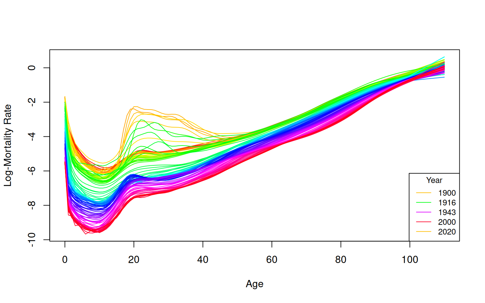
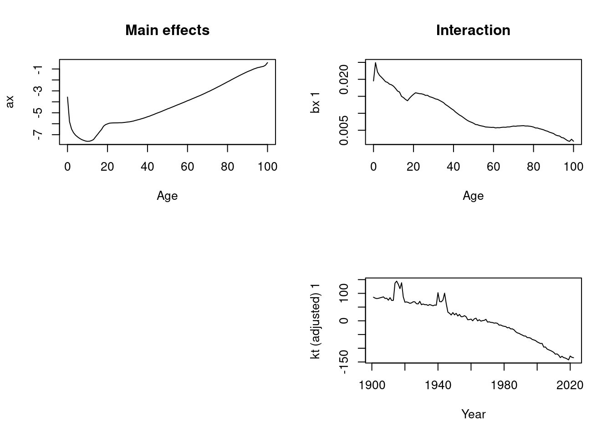
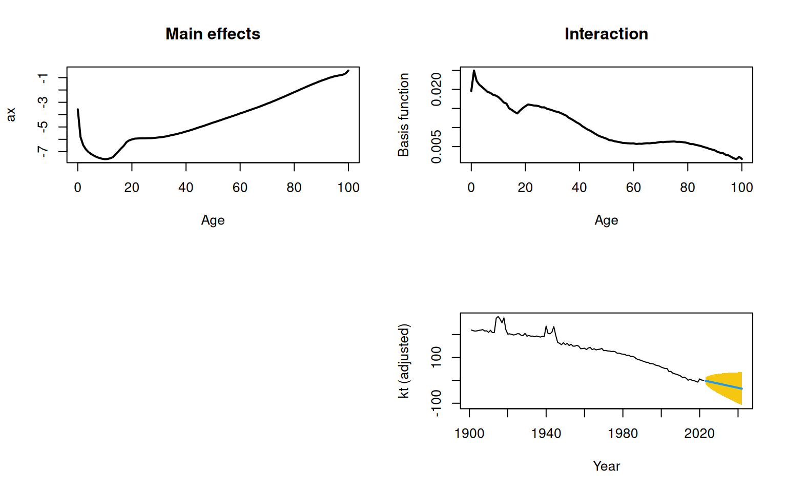
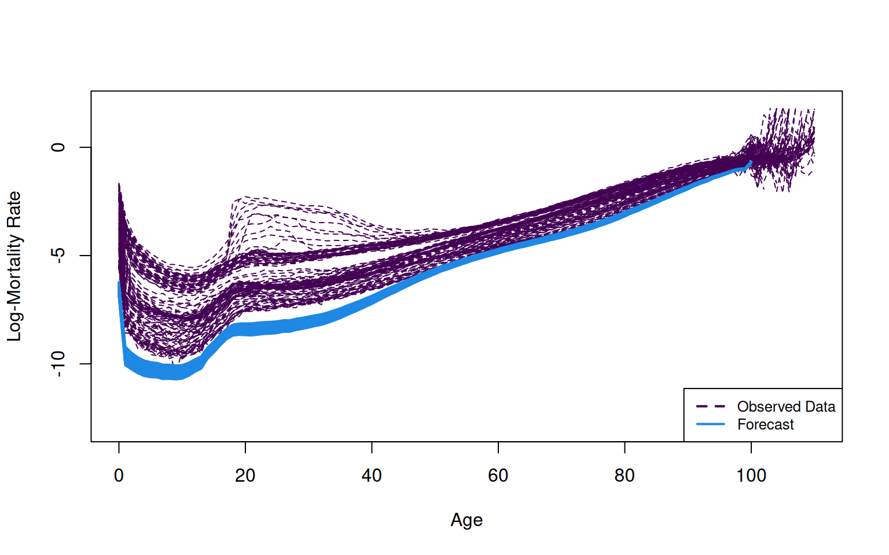
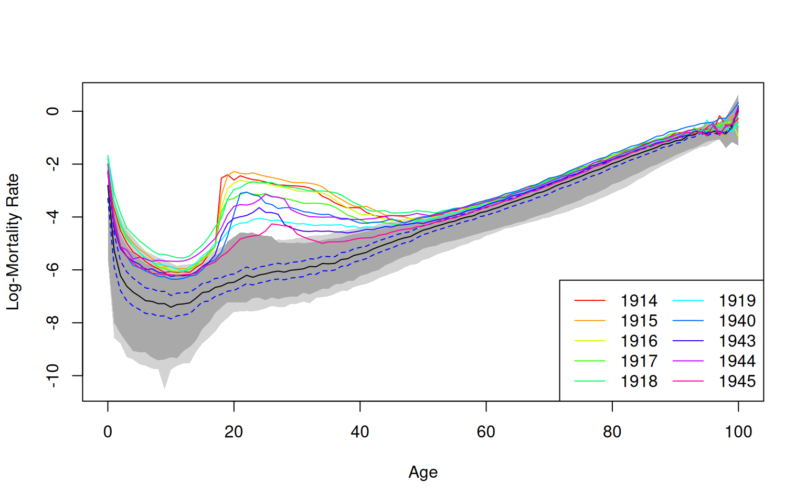
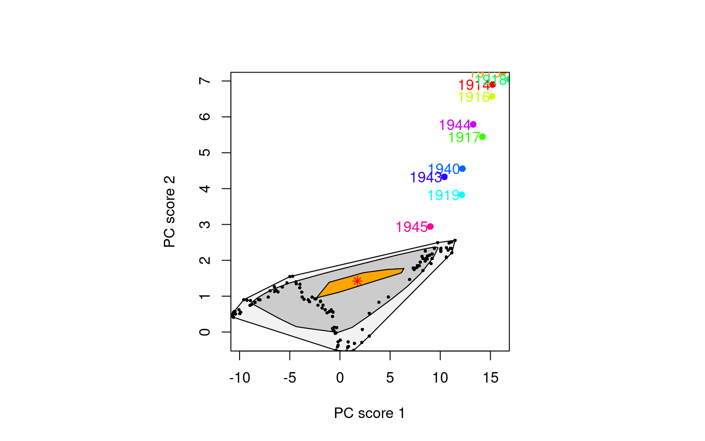
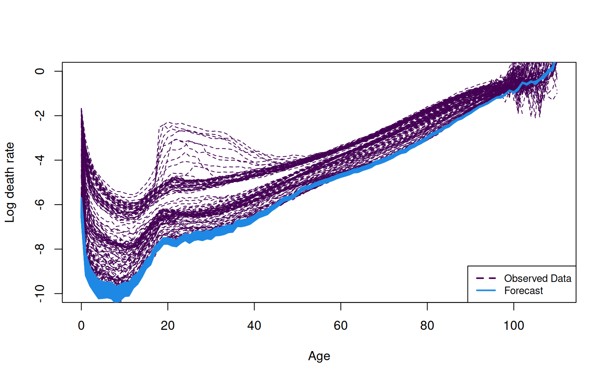

# Mortality Table Analysis in Actuarial Science: A Study on French Mortality Data

## Introduction

Session Settings

``` r
# Graphs----
face_text='plain'
face_title='plain'
size_title = 14
size_text = 11
legend_size = 11

global_theme <- function() {
  theme_minimal() %+replace%
    theme(
      text = element_text(size = size_text, face = face_text),
      legend.position = "bottom",
      legend.direction = "horizontal", 
      legend.box = "vertical",
      legend.key = element_blank(),
      legend.text = element_text(size = legend_size),
      axis.text = element_text(size = size_text, face = face_text), 
      plot.title = element_text(
        size = size_title, 
        hjust = 0.5
      ),
      plot.subtitle = element_text(hjust = 0.5)
    )
}

# Outputs
options("digits" = 2)
```

> **In Brief**
>
> This study focuses on the analysis and application of mortality tables
> within actuarial science, with a particular emphasis on examining
> French mortality data. Although the Lee-Carter model is widely used
> for mortality projections, it has significant limitations,
> particularly in its sensitivity to outliers. Outliers can skew
> mortality rate estimations, leading to inaccurate forecasts—an issue
> of critical importance in actuarial work.
>
> To address this challenge, we utilize the `rainbow` package for
> detecting outliers in the dataset, followed by the application of the
> `HUrob` method. The `HUrob` method is a robust statistical approach
> specifically designed to mitigate the influence of outliers, thereby
> ensuring more accurate and reliable mortality forecasts.
>
> This document provides a comprehensive guide, covering each stage from
> data importation to advanced modeling and the interpretation of
> results, equipping readers with the necessary tools to perform robust
> mortality analysis in actuarial contexts.

### Required Packages

Show the code

``` r
required_libraries <- c(
  "CASdatasets",
  "tidyverse", 
  "demography",
  "rainbow",
  "forecast",
  "kableExtra",
  "RColorBrewer"
)
invisible(lapply(required_libraries, library, character.only = TRUE))
```

### Data

The data used in this vignette are sourced from the Human Mortality
Database (HMD), a collaborative project by the Max Planck Institute for
Demographic Research (Germany), University of California, Berkeley
(USA), and French Institute for Demographic Studies (France). Available
[here](www.mortality.org).

It is a comprehensive repository of detailed mortality and population
data. The dataset contains age-specific mortality rates for France,
which are critical for analyzing mortality trends and making future
projections. Accurate mortality data serves as the foundation for many
actuarial tasks, including premium setting, reserve calculation, and the
assessment of pension fund solvency.

The dataset is accessed via the `hmd.mx` function from the `demography`
package, which facilitates the direct download of mortality data from
the HMD. The data is structured as a `demogdata` object, comprising the
following components:

- **Years**: A vector indicating the range of years for which mortality
  data is available (e.g., 1900-2022).
- **Ages**: A vector representing the specific ages for which mortality
  rates are recorded, typically ranging from 0 to 110+.
- **Rates**: A matrix where each row corresponds to a specific age and
  each column represents a year. The values are the logarithms of
  mortality rates, defined as the natural logarithm of the number of
  deaths per 1,000 individuals at a specific age and year.
- **Population**: A matrix analogous to the rates matrix, representing
  the population exposed to risk at each age and year.
- **Deaths**: A matrix that captures the actual number of deaths
  recorded for each age and year.
- **Type**: A character string that specifies whether the data pertains
  to “male”, “female”, or “total” populations.

### Purpose

In the aftermath of a wars or significant public health event, mortality
rates can fluctuate unpredictably. For insurance companies, this
variability presents a critical challenge: accurately forecasting
mortality rates is essential for pricing life insurance policies,
determining annuity payments, and calculating the reserves required to
cover future claims. If mortality forecasts are inaccurate, it could
lead to substantial financial losses, threaten the solvency of an
insurer, or impair its ability to meet obligations to policyholders.
Therefore, precise and reliable mortality forecasting is not just an
academic exercise but a practical necessity for ensuring the financial
stability and competitiveness of insurance products.

To address these challenges, this vignette provides a practical and
comprehensive guide to analyzing mortality tables, with a specific focus
on French mortality data. We will demonstrate the application of
advanced actuarial methods to improve mortality forecasting, ensuring
that the forecasts remain robust even in the presence of anomalies such
as outliers.

To achieve this, we will first utilize the **Lee-Carter model**, a
widely recognized method for mortality projections. This model is
effective in capturing long-term mortality trends but is sensitive to
outliers—an issue that can lead to distorted mortality rate estimates
and inaccurate forecasts.

To mitigate these risks, we will demonstrate the use of the **rainbow
package** for detecting outliers in the dataset. Identifying and
managing outliers is crucial for maintaining the accuracy of forecasts.
Following this, we will implement the **HUrob method**, a robust
statistical approach specifically designed to reduce the impact of
outliers. By employing `HUrob`, we can ensure that our mortality
forecasts are both accurate and reliable, even in the presence of data
anomalies.

In summary, this vignette will guide you through a practical approach to
improving mortality forecasts, directly addressing the challenges
insurers face in an unpredictable world. By following these methods, you
will be better equipped to manage the financial risks associated with
fluctuating mortality rates, ensuring the solvency and stability of
insurance operations.

### Importation

To access the Human Mortality Database (HMD) in R, you need to use the
`demography` package. With your HMD login credentials, you can retrieve
mortality data for specific countries using the `hmd.mx()` function. For
example, to download data for France, you can use the country code
`"FRATNP"`. Simply replace your email and password with your own
credentials in the following code, and the data will be ready for
analysis:

`france <- hmd.mx("FRATNP", "your email", "your password", label = "FRA")`

In this vignette, we use a subset of the French HMD database hosted in
CASdatasets name `freHMD`.

## Overview of a Mortality Table

To stabilize the variance associated with high age-specific mortality
rates, the raw data is automatically transformed by taking the logarithm
in the plot function and other related functions within the `demography`
package. This logarithmic transformation is particularly beneficial for
actuaries, as it ensures that the model’s outputs are both reliable and
interpretable across different age groups. This is crucial when
assessing the risk profiles of various insurance products, where
accurate and consistent modeling of mortality rates is essential. As a
result, the mortality models discussed in this chapter are all presented
on a log scale.

``` r
france.sm <- smooth.demogdata(france, obs.var = "theoretical")

colors <- colorRampPalette(rainbow(length(france.sm$year)))(length(france.sm$year))

plot(france.sm, series = "male", type = "l",
     col = colors,
     main = "",
     ylab = "Log-Mortality Rate", xlab = "Age")


selected_years <- c(1900, 1916, 1943, 2000, 2020)
legend_colors <- colors[france.sm$year %in% selected_years]

legend("bottomright", legend = as.character(selected_years),
       col = legend_colors,
       lty = 1, 
       title = "Year", cex = 0.8)
```



Figure 1: Smoothed Male Log-Mortality Rates from 1900 to 2022 in France

The plot displays smoothed mortality rates over time, revealing a
characteristic “U-shape” mortality pattern: high rates during infancy, a
decline in early adulthood, and a steady increase with age. The
smoothing technique effectively clarifies underlying trends by reducing
noise in the data, making significant patterns more discernible.
Notably, the plot highlights the impact of historical events, with
distinct “humps” corresponding to increased mortality during World War I
and World War II. Additionally, a noticeable decrease in mortality rates
among younger populations over time is evident, reflecting improvements
in public health and living conditions.

This visualization serves as a foundational tool for further analysis,
including forecasting, outlier detection, and robust modeling, providing
a clear starting point for more advanced actuarial assessments.

## Fitting the Lee-Carter Model

### Lee-Carter Model Structure

The model structure proposed by Lee and Carter ([1992](#ref-lee1992)) is
represented by the following equation:

$${\log}(m_{x,t}) = a_{x} + b_{x}k_{t} + \epsilon_{x,t},\quad\text{(1)}$$

Where:

- $a_{x}$ represents the age-specific pattern of the log mortality rates
  averaged across years.
- $b_{x}$ is the first principal component, capturing the relative
  change in the log mortality rate at each age.
- $k_{t}$ denotes the first set of principal component scores for year
  $t$, measuring the overall level of the log mortality rates.
- $\epsilon_{x,t}$ is the residual at age $x$ and year $t$, accounting
  for the model’s error term.

The model assumes homoskedastic errors and is typically estimated using
singular value decomposition (SVD), a method that efficiently extracts
the principal components.

#### Over-Parameterization and Identifiability

The Lee-Carter (LC) model in Equation (1) is over-parameterized, meaning
that the model’s structure remains invariant under certain
transformations:

$$\left. \{ a_{x},b_{x},k_{t}\}\rightarrow\{ a_{x},b_{x}/c,ck_{t}\}, \right.$$

$$\left. \{ a_{x},b_{x},k_{t}\}\rightarrow\{ a_{x} - cb_{x},b_{x},k_{t} + c\}. \right.$$

To address this issue and ensure model identifiability, Lee and Carter
(1992) imposed the following constraints:

$$\sum\limits_{t = 1}^{n}k_{t} = 0,$$

$$\sum\limits_{x = x_{1}}^{x_{p}}b_{x} = 1.$$

These constraints normalize the model, ensuring that $k_{t}$ is centered
and that the age-specific impact $b_{x}$ is appropriately scaled.

#### Adjusting and Forecasting $k_{t}$

In addition to the above constraints, the Lee-Carter method adjusts
$k_{t}$ by refitting it to the observed total number of deaths. This
adjustment process gives more weight to ages with higher mortality
rates, effectively counterbalancing the impact of the logarithmic
transformation of the mortality rates.

The adjusted $k_{t}$ is then extrapolated using time series models,
particularly ARIMA models. Lee and Carter ([1992](#ref-lee1992))
utilized a random walk with drift (RWD) model for this purpose, which is
expressed as:

$$k_{t} = k_{t - 1} + d + e_{t},$$

where:

- $d$ represents the drift parameter, measuring the average annual
  change in the series.
- $e_{t}$ is an uncorrelated error term.

The random walk with drift (RWD) model has proven to provide
satisfactory results in various applications, as noted by subsequent
studies (Tuljapurkar et al. ([2000](#ref-tuljapurkar2000)); Lee and
Miller ([2001](#ref-lee2001)); Lazar and Denuit
([2005](#ref-lazar2005))).

``` r
lc.male <- lca(france, series="male")
plot(lc.male)
```



Once the Lee-Carter model is fitted, actuaries can utilize it to
forecast future mortality rates, a critical step in pricing life
insurance products, setting aside reserves, and estimating liabilities
in pension schemes. The three panels in the plot effectively illustrate
the main effects and interaction terms that the Lee-Carter model
captures:

1.  **$a_{x}$ - Main Effects (Age-Specific Average Mortality Pattern)**:
    This panel displays the general mortality pattern across different
    ages. The characteristic “U-shape” is evident, with higher mortality
    rates during infancy, a decline through early adulthood, and a
    steady increase with advancing age. This pattern aligns with the
    general mortality trends observed in many populations, providing a
    foundational understanding of age-specific mortality behavior.

2.  **$b_{x}$ - Age-Specific Sensitivity to the Mortality Index**: This
    panel highlights the sensitivity of each age group to changes in the
    overall mortality index \$ k_t \$. Younger age groups exhibit higher
    sensitivity, which gradually decreases with age. This implies that
    fluctuations in mortality, whether improvements or deteriorations,
    have a more pronounced impact on younger individuals compared to
    older ones.

3.  **$k_{t}$ - Time Index of Mortality**: The bottom panel traces the
    changes in mortality over time, capturing the influence of
    historical events and broader trends. The noticeable “humps” in the
    early 20th century correspond to periods of war and other
    significant disruptions. The long-term decline in $k_{t}$ reflects
    overall improvements in mortality rates over the years, indicative
    of advancements in healthcare, living conditions, and public health
    interventions.

These components are essential for forecasting future mortality rates, a
process facilitated by the `forecast()` function from the `forecast`
package. The output of the Lee-Carter model, particularly the forecasted
$k_{t}$, enables actuaries to project future mortality rates, which is
crucial for financial planning and decision-making in life insurance and
pension schemes.

These visualizations are invaluable tools for actuaries, aiding in the
communication of mortality trends to stakeholders, regulators, and
policymakers. By presenting the projections in a clear and transparent
manner, actuaries ensure that their forecasts are based on robust
statistical analysis, thereby supporting informed decision-making.

``` r
# Perform the forecast
forecast.lc.male <- forecast(lc.male, h = 20)
```

Code for plotting the Lee-Carter components

``` r
# Plot the forecast components
plot(forecast.lc.male, plot.type = "component", lwd = 2)
```



Figure 2: Forecast Components for Male Mortality

Code for plotting the Lee-Carter forecast

``` r
# Plot the historical mortality data with adjusted line width and color
plot(france, series = "male", ylim = c(-13, 2), lty = 2, lwd = 1, col = "#440154FF",
     main = "",
     ylab = "Log-Mortality Rate", xlab = "Age")

# Add the forecast lines with distinct color and line type
lines(forecast.lc.male, col = "#1E88E5", lty = 1, lwd = 2)

# Add a legend to distinguish between observed and forecasted data
legend("bottomright", legend = c("Observed Data", "Forecast"),
       col = c("#440154FF", "#1E88E5"), lty = c(2, 1), lwd = 2, cex = 0.8)
```



Figure 3: Lee-Carter Method: Observed and Forecasted (next 20 years)
Male Log-Mortality Rates in France

#### Interpretation of the Plot

The plot displays the smoothed historical male death rates for France
from 1900 to 2022, along with forecasted mortality rates. While the
Lee-Carter model is a widely utilized tool in actuarial science, the
results presented here raise concerns about the accuracy of its
forecasts:

- **Observed Data (Black Dashed Line)**: The historical mortality rates
  exhibit the characteristic “U-shape” pattern, with elevated mortality
  at infancy, reduced rates during early adulthood, and a steady
  increase with advancing age. However, the density of the black lines
  makes it challenging to discern specific trends, particularly among
  younger age groups, where subtle variations are easily obscured.

- **Forecasted Data (Blue Line)**: The forecasted mortality rates,
  depicted by the blue line, generally align with the overall trend of
  the observed data. However, these forecasts appear overly optimistic,
  projecting significantly lower future mortality rates than might be
  realistic. This discrepancy raises concerns about the model’s ability
  to accurately capture the complexity of future mortality trends,
  particularly in light of potential unforeseen events or structural
  changes in population health.

- **Model Effectiveness**: Although the Lee-Carter model effectively
  captures the historical trend of declining mortality rates, the
  forecasts generated here may be too “optimistic,” predicting
  unrealistically low mortality rates in the future. Such over-optimism
  in the forecasts could be misleading, potentially leading to an
  underestimation of future mortality risks. This poses a significant
  risk for actuarial practices, where accurate mortality projections are
  crucial for pricing, reserving, and long-term financial planning.

Given these observations, it is essential to critically evaluate the
model’s assumptions and consider the potential limitations of the
Lee-Carter model in forecasting long-term mortality trends.
Supplementing this analysis with alternative models or incorporating
scenario testing could provide a more comprehensive understanding of
future mortality risks.

#### Key Takeaways

- The Lee-Carter model serves as a foundational framework for mortality
  forecasting. However, the results presented here suggest that the
  model may be overly optimistic, potentially underestimating future
  death rates.

- To enhance the reliability and practical applicability of these
  forecasts, it is essential to revisit the model’s assumptions and
  explore alternative approaches or adjustments, particularly in
  relation to outliers that might be skewing the results.

- To address these concerns, we will implement the `HUrob` method, which
  is specifically designed to handle outliers that could be influencing
  the model’s forecasts. These outliers may be contributing to the
  overly optimistic predictions, and `HUrob` provides a robust mechanism
  to adjust for these anomalies, thereby producing more accurate and
  reliable forecasts.

This interpretation underscores the importance of critically evaluating
both the model and its output, ensuring that the forecasts are not only
statistically robust but also aligned with realistic expectations for
future mortality trends. By incorporating methods like `HUrob`, we can
better manage the influence of outliers and improve the accuracy of our
mortality projections, ultimately leading to more reliable actuarial
decisions.

## Outlier Detection with Rainbow package

We will proceed as if unaware of the historical impact of wars,
preparing the data as functional data to apply the `fboxplot` method.
The `fboxplot` function generates a functional boxplot, which extends
the traditional boxplot concept to functional data. This method provides
a comprehensive summary of the distribution of mortality rate curves by:

- **Central Region**: Identifying the most typical curve, representing
  the central tendency of the data.
- **Variability**: Highlighting the variability among the mortality
  curves, which is depicted as shaded regions. These regions indicate
  the spread of the data and help visualize how mortality rates
  fluctuate across different years or age groups.
- **Outliers**: Detecting potential outliers, represented by curves that
  fall outside the shaded envelope. These outliers may correspond to
  unusual years or age groups with mortality rates that significantly
  deviate from the norm, potentially due to historical events like wars
  or data anomalies.

By applying the `fboxplot` method, we can effectively identify and
analyze these deviations, enabling a more nuanced understanding of the
data. This approach allows for the detection of unusual patterns that
may require further investigation or adjustment in the modeling process,
particularly in cases where historical events or anomalies have a
significant impact on mortality trends.

``` r
# filtering age <= 100 and years >= 1880
year_filter <- france$year >= 1880
filtered_years <- france$year[year_filter]
filtered_mortality_rates <- france$rate$male[, year_filter]

age_filter <- france$age <= 100
filtered_ages <- france$age[age_filter]
log_mortality_rates <- log(filtered_mortality_rates[age_filter, ])

# Create a Functional Data Set (fds) object for the fboxplot
log_mortality_fds <- fds(x = filtered_ages, y = log_mortality_rates)
```

- [Functional boxplot](#tabset-1-1)
- [Functional bagplot](#tabset-1-2)

&nbsp;

- Code for the following functional HDR boxplot
  ``` r
  fboxplot(data = log_mortality_fds,
           na.rm = TRUE,
           plot.type = "functional",   # For a functional boxplot
           type = "bag",               # For an bag boxplot
           alpha = c(0.05, 0.5),       # Coverage level
           projmethod = "PCAproj",     # Use PCA projection method
           factor = 1.96,              # Factor for the outer region
           xlab = "Age",               
           ylab = "Log-Mortality Rate",
           shadecols = gray((9:1)/10), # Colors for shaded regions
           pointcol = 1,               # Color of points (outliers and mode)
           plotlegend = TRUE,         
           legendpos = "bottomright",  
           ncol = 2)                  
  ```

  

  Figure 4: Functional Boxplot of Log-Mortality Rates in France

  The functional HDR boxplot illustrates the distribution of log
  mortality rates across various years during and after the World Wars.
  The shaded regions in the plot represent the central 50% and 95% of
  the data, effectively highlighting the typical mortality patterns
  observed during these periods.

  The year 1919 is identified as an outlier, displaying
  higher-than-expected mortality rates despite occurring after World
  War I. This anomaly could be attributed to the lingering effects of
  the war, the 1918 influenza pandemic, or other socio-economic
  disruptions. This observation underscores the fact that even years
  outside of direct wartime can exhibit atypical mortality patterns due
  to the residual effects of conflict or other external factors.

  The periods 1914-1918 (WWI) and 1940-1945 (WWII) are characterized by
  elevated mortality rates, particularly among younger and middle-aged
  populations, reflecting the direct impact of these conflicts on the
  population.

  This analysis demonstrates the utility of functional HDR boxplots in
  effectively identifying outliers and typical patterns in mortality
  data, providing valuable insights into how significant historical
  events and their aftermath can shape mortality trends.

Code for the following functional HDR boxplot

``` r
fboxplot(data = log_mortality_fds,
         na.rm = TRUE,
         plot.type = "bivariate",   # For a bivariate boxplot
         type = "bag",               # For an bag boxplot
         alpha = c(0.05, 0.5),       # Coverage level
         projmethod = "PCAproj",     # Use PCA projection method
         factor = 1.96,              # Factor for the outer region
         xlab = "Age",               
         ylab = "Log-Mortality Rate",
         shadecols = gray((9:1)/10), # Colors for shaded regions
         pointcol = 1,               # Color of points (outliers and mode)
         plotlegend = TRUE,         
         legendpos = "bottomright",  
         ncol = 2)                  
```



Figure 5: Bivariate Boxplot of Log-Mortality Rates in France

## Robust Hyndman–Ullah (HUrob) Method

Outliers, or unusual data points, can seriously affect the performance
of modeling and forecasting. The `HUrob` method is designed to eliminate
their effect. This method utilizes the reflection-based principal
component analysis (RAPCA) algorithm of Hubert et al.
([2002](#ref-hubert2002fast)) to obtain projection-pursuit estimates of
principal components and their associated scores. The integrated squared
error provides a measure of the accuracy of the principal component
approximation for each year (Hyndman and Ullah
([2007](#ref-hyndman2007robust))). Outlying years result in a larger
integrated squared error than the critical value obtained by assuming
normality of $\epsilon_{t}(x)$ (see Hyndman and Ullah
([2007](#ref-hyndman2007robust)) for details). By assigning zero weight
to outliers, the `HUrob` method can then be used to model and forecast
mortality rates without the possible influence of outliers.

### How the `HUrob` Method Works

The `HUrob` method uses an advanced technique called reflection-based
principal component analysis (RAPCA). This technique helps to identify
the main patterns in the data while filtering out those outliers that
could lead to inaccurate predictions.

Here’s a simplified explanation:

- **Principal Components**: Think of these as the main patterns in your
  data. The method tries to capture these patterns and ignore the noise
  or outliers.
- **Outliers**: These are unusual data points that don’t fit the general
  pattern. If left unchecked, they can distort the model’s predictions.

By assigning zero weight to outliers, the `HUrob` method effectively
ignores these problematic data points, making the model’s predictions
more robust and trustworthy.

Using the functional data analysis paradigm of Ramsay and Silverman
([2005](#ref-ramsay2005)), Hyndman and Ullah
([2007](#ref-hyndman2007robust)) proposed a nonparametric method for
modeling and forecasting log mortality rates. This approach extends the
Lee-Carter (LC) method in four ways:

- The log mortality rates are smoothed prior to modeling.
- Functional principal components analysis (FPCA) is used.
- More than one principal component is used in forecasting.
- The forecasting models for the principal component scores are
  typically more complex than the RWD model.

The log mortality rates are smoothed using penalized regression splines.
To emphasize that age, $x$, is now considered a continuous variable, we
write $m_{t}(x)$ to represent mortality rates for age
$x \in \lbrack x_{1},x_{p}\rbrack$ in year $t$. We then define
$z_{t}(x) = {\log}m_{t}(x)$ and write:

$$z_{t}(x_{i}) = f_{t}(x_{i}) + \sigma_{t}(x_{i})\epsilon_{t,i},\quad i = 1,\ldots,p,\quad t = 1,\ldots,n,\ (2)$$

where $f_{t}(x_{i})$ denotes a smooth function of $x$ as before;
$\sigma_{t}(x_{i})$ allows the amount of noise to vary with $x_{i}$ in
year $t$, thus rectifying the assumption of homoskedastic error in the
LC model; and $\epsilon_{t,i}$ is an independent and identically
distributed standard normal random variable.

Given continuous age $x$, functional principal components analysis
(FPCA) is used in the decomposition. The set of age-specific mortality
curves is decomposed into orthogonal functional principal components and
their uncorrelated principal component scores. That is:

$$f_{t}(x) = a(x) + \sum\limits_{j = 1}^{J}b_{j}(x)k_{t,j} + e_{t}(x),$$

where $a(x)$ is the mean function estimated by
$\widehat{a}(x) = \frac{1}{n}\sum_{t = 1}^{n}f_{t}(x)$;
$\{ b_{1}(x),\ldots,b_{J}(x)\}$ is a set of the first $J$ functional
principal components; $\{ k_{t,1},\ldots,k_{t,J}\}$ is a set of
uncorrelated principal component scores; $e_{t}(x)$ is the residual
function with mean zero; and $J < n$ is the number of principal
components used. Note that we use $a(x)$ rather than $a_{x}$ to
emphasize that $x$ is treated as a continuous variable.

Multiple principal components are used because the additional components
capture non-random patterns that are not explained by the first
principal component (Booth et al. ([2002](#ref-booth2002)); Renshaw and
Haberman ([2003](#ref-renshaw2003)); Koissi et al.
([2006](#ref-koissi2006))). Hyndman and Ullah
([2007](#ref-hyndman2007robust)) found $J = 6$ to be larger than the
number of components actually required to produce white noise residuals,
and this is the default value. The conditions for the existence and
uniqueness of $k_{t,j}$ are discussed by Cardot, Ferraty & Sarda (2003).

Although Lee and Carter ([1992](#ref-lee1992)) did not rule out the
possibility of a more complex time series model for the $k_{t}$ series,
in practice, an RWD model has typically been employed in the LC method.
For higher-order principal components, which are orthogonal by
definition to the first component, other time series models arise for
the principal component scores. For all components, the `HUrob` method
selects the optimal time series model using standard model-selection
procedures (e.g., AIC). By conditioning on the observed data
$I = \{ z_{1}(x),\ldots,z_{n}(x)\}$ and the set of functional principal
components $B = \{ b_{1}(x),\ldots,b_{J}(x)\}$, the $h$-step-ahead
forecast of $z_{n + h}(x)$ can be obtained by:

$${\widehat{z}}_{n + h|n}(x) = E\lbrack z_{n + h}(x)|I,B\rbrack = \widehat{a}(x) + \sum\limits_{j = 1}^{J}b_{j}(x){\widehat{k}}_{n + h|n,j},$$

where ${\widehat{k}}_{n + h|n,j}$ denotes the $h$-step-ahead forecast of
$k_{n + h,j}$ using a univariate time series model, such as the optimal
ARIMA model selected by the automatic algorithm of Hyndman et al.
([2008](#ref-hyndman2008)), or an exponential smoothing state space
model (Hyndman et al. ([2008](#ref-hyndman2008))).

Because of the orthogonality of all components, it is easy to derive the
forecast variance as:

$${\widehat{v}}_{n + h|n}(x) = \text{var}\lbrack z_{n + h}(x)|I,B\rbrack = \sigma_{a}^{2}(x) + \sum\limits_{j = 1}^{J}b_{j}^{2}(x)u_{n + h|n,j} + v(x) + \sigma_{t}^{2}(x),$$

where $\sigma_{a}^{2}(x)$ is the variance of $\widehat{a}(x)$;
$u_{n + h|n,j}$ is the variance of $k_{n + h,j}|k_{1,j},\ldots,k_{n,j}$
(obtained from the time series model); $v(x)$ is the variance of
$e_{t}(x)$; and $\sigma_{t}(x)$ is defined in Equation (2). This
expression is used to construct prediction intervals for future
mortality rates in R.

#### Key Enhancements Over Traditional Methods

The `HUrob` method improves upon traditional methods like the Lee-Carter
(LC) model in several ways:

- **Smoothing**: Log mortality rates are smoothed using techniques that
  stabilize the data, reducing the impact of random fluctuations.
- **Principal Components Analysis (PCA)**: Instead of relying on just
  one principal component, this method uses multiple components to
  capture more of the complexity in the data.
- **Advanced Time Series Models**: For predicting future trends, the
  `HUrob` method uses sophisticated models like ARIMA, which are more
  flexible and accurate than simpler models.

#### Putting It All Together

In simple terms, the `HUrob` method is a powerful tool for making more
accurate predictions about future mortality rates. By carefully managing
outliers and using advanced statistical techniques, this method helps
actuaries and analysts make better-informed decisions, whether they are
pricing life insurance products, setting aside reserves, or planning for
the future.

### Conclusion

The `HUrob` method enhances mortality rate modeling by addressing the
impact of outliers using reflection-based principal component analysis
(RAPCA). By eliminating the influence of outliers, the method ensures
more robust forecasts. The approach builds on the Lee-Carter model by
smoothing log mortality rates, applying functional principal components
analysis (FPCA), and using multiple principal components for
forecasting. These components are modeled with more complex time series
models, like ARIMA, instead of the simpler Random Walk with Drift (RWD).
The method effectively captures mortality trends while accounting for
varying noise across ages and years, leading to more accurate
predictions with well-defined prediction intervals.

- [Fitting and forecasting HUrob](#tabset-2-1)
- [HUrob parameters](#tabset-2-2)

&nbsp;

- ``` r
  # Apply the HUrob method using reflection-based PCA (RAPCA)
  fdm_france <- fdm(france, series="male", method="rapca")

  france.fcast <- forecast(fdm_france,20)
  ```

  Code for the following forecast
  ``` r
  # Plot the observed and forecasted mortality rates
  plot(france, series="male",
       main = "",
       ylim=c(-10, 0),
       col = "#440154FF",
       lty=2,
       ylab = "Log death rate", xlab = "Age")

  lines(france.fcast, col = "#1E88E5", lty = 1, lwd = 2)

  # Add a legend to distinguish between observed and forecasted data
  legend("bottomright", legend = c("Observed Data", "Forecast"),
         col = c("#440154FF", "#1E88E5"), lty = c(2, 1), lwd = 2, cex = 0.8)
  ```

  

  Figure 6: HUrob Method: Log-Mortality rates Observed and Forecasted
  (next 20 years) in France

  The plot displays the log death rates for males in France from 1900 to
  2022, across various age groups. The trends indicate that mortality
  rates have generally decreased over time, particularly at younger
  ages, but have started to rise again in older age groups.

  This forecast appears to be less optimistic than the Lee-Carter
  projections. While it still indicates improvements in mortality at
  younger ages, the flattening and slight increase in death rates at
  older ages suggest a more realistic outlook. The forecast acknowledges
  the challenges in further reducing mortality, particularly among older
  populations, reflecting a more cautious and realistic approach to
  future mortality trends.

``` r
models(france.fcast)
```

    -- Coefficient 1 --
    Series: xx[, i]
    ARIMA(0,1,1) with drift

    Coefficients:
             ma1   drift
          -0.177  -0.172
    s.e.   0.098   0.094

    sigma^2 = 1.61:  log likelihood = -199
    AIC=405   AICc=405   BIC=413

    -- Coefficient 2 --
    Series: xx[, i]
    ARIMA(1,1,1) with drift

    Coefficients:
           ar1    ma1  drift
          0.35  -0.91  0.030
    s.e.  0.11   0.06  0.013

    sigma^2 = 0.806:  log likelihood = -158
    AIC=323   AICc=324   BIC=335

    -- Coefficient 3 --
    Series: xx[, i]
    ARIMA(2,1,2)

    Coefficients:
           ar1    ar2    ma1   ma2
          0.39  -0.46  -1.04  0.64
    s.e.  0.17   0.12   0.15  0.13

    sigma^2 = 0.823:  log likelihood = -158
    AIC=327   AICc=327   BIC=341

    -- Coefficient 4 --
    Series: xx[, i]
    ARIMA(1,1,1)

    Coefficients:
           ar1     ma1
          0.54  -0.946
    s.e.  0.14   0.093

    sigma^2 = 0.533:  log likelihood = -133
    AIC=272   AICc=273   BIC=281

    -- Coefficient 5 --
    Series: xx[, i]
    ARIMA(2,0,0) with zero mean

    Coefficients:
            ar1    ar2
          0.547  0.192
    s.e.  0.088  0.088

    sigma^2 = 0.611:  log likelihood = -142
    AIC=291   AICc=291   BIC=299

    -- Coefficient 6 --
    Series: xx[, i]
    ARIMA(0,0,2) with zero mean

    Coefficients:
           ma1    ma2
          0.28  0.257
    s.e.  0.09  0.076

    sigma^2 = 0.297:  log likelihood = -98
    AIC=202   AICc=203   BIC=211

The output summarizes various ARIMA models fitted to different
components of the `HUrob` method.

- **Coefficient 1**: ARIMA(0,1,1) with drift. This model reflects a weak
  negative moving average (ma1 = -0.177) and a negative drift (-0.172),
  suggesting a slight downward trend over time. The fit is moderate,
  with AIC = 405 and BIC = 413.

- **Coefficient 2**: ARIMA(1,1,1) with drift. This model captures
  stronger autocorrelation with ar1 = 0.35 and ma1 = -0.90. The drift
  term is positive (0.030), suggesting a slight upward trend. The fit
  improves with AIC = 323 and BIC = 335.

- **Coefficient 3**: ARIMA(2,1,2). A more complex model with two
  autoregressive and two moving average components. The mixed signs in
  the coefficients indicate intricate temporal dynamics. The model fits
  similarly to Coefficient 2, with AIC = 327 and BIC = 341.

- **Coefficient 4**: ARIMA(1,1,1). A simpler model with no drift,
  featuring moderate autocorrelation (ar1 = 0.54) and strong negative
  moving average (ma1 = -0.946). This model has a lower sigma^2 and
  improves in fit with AIC = 272 and BIC = 281.

- **Coefficient 5**: ARIMA(2,0,0). This model features autoregressive
  terms (ar1 = 0.547, ar2 = 0.192) and does not include a constant or
  drift, implying the process has no inherent trend. The residual
  variance is moderate (sigma^2 = 0.611), and the fit is reasonable with
  AIC = 291 and BIC = 299.

- **Coefficient 6**: ARIMA(0,0,2). This model includes two moving
  average terms (ma1 = 0.28, ma2 = 0.257) and also does not have a
  constant, suggesting no trend. It achieves the lowest residual
  variance (sigma^2 = 0.297) and provides a solid fit with AIC = 202 and
  BIC = 211.

#### Forecasting and Reconstruction

The coefficients from these ARIMA models are used to forecast the
principal component scores derived from the functional principal
component analysis (FPCA). These scores represent the key patterns in
the mortality data over time.

- **Forecasting**: The ARIMA models, using the estimated coefficients
  (e.g., `ar1`, `ma1`, `drift`), predict future values of these scores.

- **Reconstruction**: The forecasted scores are then combined with the
  functional principal components to reconstruct future mortality rates
  using the formula:

$${\widehat{z}}_{n + h|n}(x) = \widehat{a}(x) + \sum\limits_{j = 1}^{J}b_{j}(x){\widehat{k}}_{n + h|n,j}$$

- **Final Output**: This process yields the forecasted mortality rates,
  along with their associated variance and prediction intervals.

#### Practical Implications

These forecasts are essential for predicting future mortality trends
across different age groups, providing a robust basis for actuarial
analysis and decision-making.

## References

The date came from HMD. Human Mortality Database. Max Planck Institute
for Demographic Research (Germany), University of California, Berkeley
(USA), and French Institute for Demographic Studies (France). Available
[HMD](www.mortality.org).

Booth, Heather, John Maindonald, and Len Smith. 2002. “Applying
Lee-Carter Under Conditions of Variable Mortality Decline.” *Population
Studies* 56 (3): 325–36.

Hubert, Mia, Peter J Rousseeuw, and Sabine Verboven. 2002. “A Fast
Method for Robust Principal Components with Applications to
Chemometrics.” *Chemometrics and Intelligent Laboratory Systems* 60
(1-2): 101–11.

Hyndman, Rob J, Anne B Koehler, Ralph D Snyder, and Simone Grose. 2008.
“Forecasting with Exponential Smoothing: The State Space Approach.”
*Springer Series in Statistics*.

Hyndman, Rob J, and Md Shahid Ullah. 2007. “Robust Forecasting of
Mortality and Fertility Rates: A Functional Data Approach.”
*Computational Statistics & Data Analysis* 51 (10): 4942–56.

Koissi, Marie-Claire, Arnold F Shapiro, and George Högnäs. 2006. “The
State of the Art in the Lee–Carter Model.” *Insurance: Mathematics and
Economics* 38 (1): 2–23.

Lazar, Avner, and Michel Denuit. 2005. “Robust Methods for Actuarial
Applications.” *Insurance: Mathematics and Economics* 36 (1): 1–21.

Lee, Ronald D, and Lawrence R Carter. 1992. “Modeling and Forecasting US
Mortality.” *Journal of the American Statistical Association* 87 (419):
659–71.

Lee, Ronald D, and Timothy Miller. 2001. “Evaluating the Performance of
the Lee-Carter Method for Forecasting Mortality.” *Demography* 38 (4):
537–49.

Ramsay, James O, and Bernard W Silverman. 2005. *Functional Data
Analysis*. Springer.

Renshaw, Arthur E, and Steven Haberman. 2003. “Lee–Carter Mortality
Forecasting with Age-Specific Enhancement.” *Insurance: Mathematics and
Economics* 33 (2): 255–72.

Tuljapurkar, Shripad, Nan Li, and Carl Boe. 2000. “A Universal Pattern
of Mortality Decline in the G7 Countries.” *Nature* 405 (6788): 789–92.

## See also

For more similar mortality datasets, see
[`freMortTables`](https://dutangc.github.io/CASdatasets/reference/fremorttables.html)
: French mortality datasets or visit the [HMD](www.mortality.org)
website.
