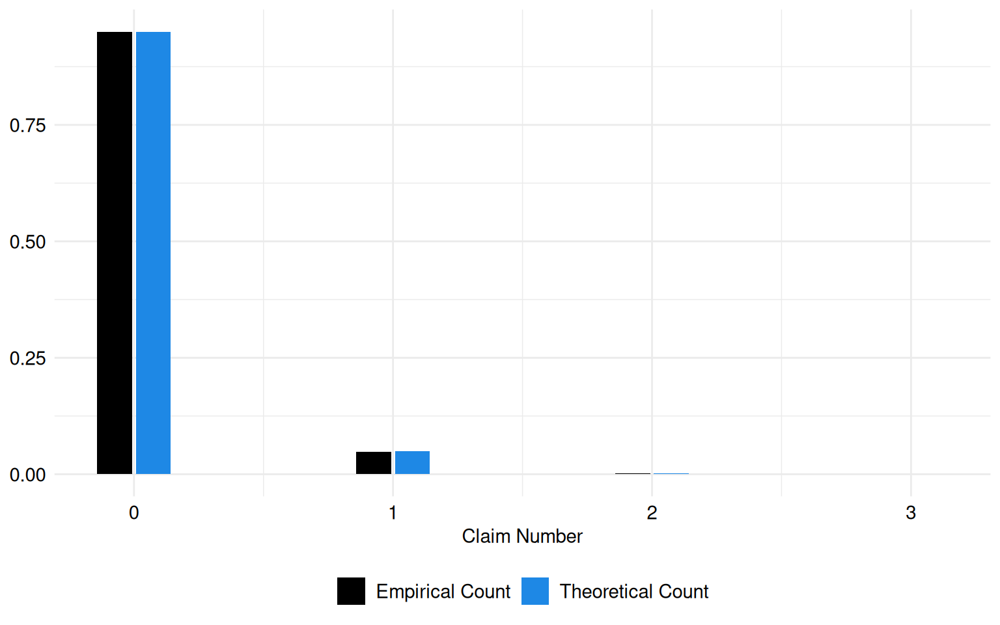
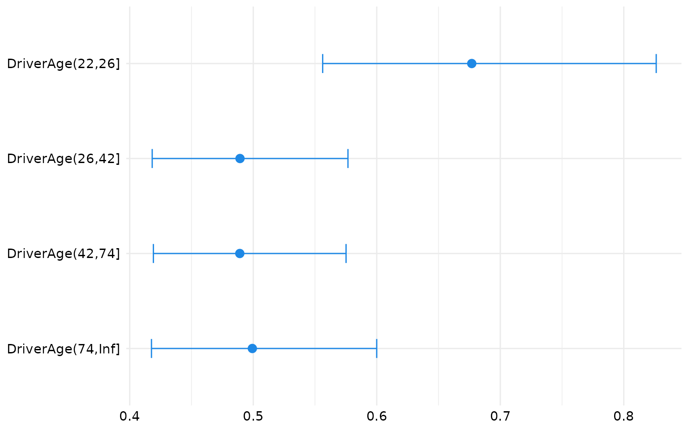
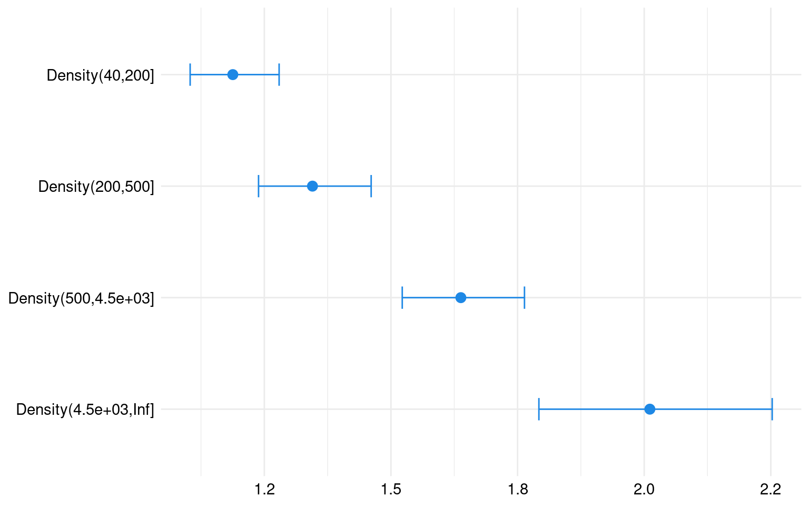

# Frequency analysis of a French Motor Third Party Liability dataset

## Introduction

Session Settings

``` r

# Graphs----
face_text='plain'
face_title='plain'
size_title = 14
size_text = 11
legend_size = 11

global_theme <- function() {
  theme_minimal() %+replace%
    theme(
      text = element_text(size = size_text, face = face_text),
      legend.position = "bottom",
      legend.direction = "horizontal", 
      legend.box = "vertical",
      legend.key = element_blank(),
      legend.text = element_text(size = legend_size),
      axis.text = element_text(size = size_text, face = face_text), 
      plot.title = element_text(
        size = size_title, 
        hjust = 0.5
      ),
      plot.subtitle = element_text(hjust = 0.5)
    )
}

# Outputs
options("digits" = 2)
```

> **In Brief**
>
> The objective of this vignette is to demonstrate the application of
> Poisson regression in analyzing insurance data, specifically focusing
> on the `freMTPLfreq` and `freMTPLsev` datasets from Charpentier
> ([2014](#ref-charpentierCAS)). These datasets provide information on
> insurance contracts and claims related to French motor third-party
> liability insurance.
>
> By leveraging Poisson regression, our goal is to model the frequency
> of claims and investigate the factors influencing claim occurrence
> within the insurance data. Understanding these factors is crucial for
> accurate risk assessment, pricing strategies, and effective
> decision-making in the insurance industry.

### Required Packages

Show the code

``` r

required_libraries <- c(
  "tidyverse", 
  "CASdatasets",
  "glmnet",
  "AER",
  "broom",
  "knitr",
  "kableExtra"
)
invisible(lapply(required_libraries, library, character.only = TRUE))
```

### Data

The Data used in this vignette come from French motor third party
liability insurance portfolio.

The first dataset, `freMTPLfreq`, encompasses details regarding
contracts and clients obtained from a French insurance company, related
to some motor insurance portfolio.

The second dataset, `freMTPLsev`, contains claims information, from the
same company.

For convenience, the `freMTPLfreq` table will be named `CONTRACTS`
hereafter. The `freMTPLsev` will be named `CLAIMS`

### Dictionaries

The list of the 10 variables from the `freMTPLfreq` dataset is reported
in [Table 1](#tbl-dict-freMTPLfreq). Similarly, the two variables
encapsulated within the `freMTPLsev` dataset are reported in table
[Table 2](#tbl-dict-freMTPLsev).

| Attribute | Type    | Description                                             |
|-----------|---------|---------------------------------------------------------|
| PolicyID  | Numeric | Unique identifier for the contract                      |
| ClaimNB   | Numeric | Number of claims during the exposure period             |
| Exposure  | Numeric | Exposure duration in years                              |
| Power     | Factor  | Power of the car (ordered categorical)                  |
| CarAge    | Numeric | Age of the car in years                                 |
| DriverAge | Numeric | Age of the driver in years                              |
| Brand     | Factor  | Brand of the car categorized                            |
| Gaz       | Factor  | Type of fuel used (diesel or regular)                   |
| Region    | Factor  | Region in France where the driver resides               |
| Density   | Numeric | Population density in the city where the driver resides |

Table 1: Content of the `freMTPLfreq` dataset: CONTRACTS

| Attribute   | Type    | Description                                 |
|-------------|---------|---------------------------------------------|
| PolicyID    | Numeric | Unique identifier for the contract          |
| ClaimAmount | Numeric | Cost of the claim, seen as at a recent date |

Table 2: Content of the `freMTPLsev` dataset: CLAIMS

### Importation

Code for importing our datasets

``` r

data("freMTPLfreq")
data("freMTPLsev")

CONTRACTS <- freMTPLfreq |>
  filter(Exposure > 0.90)


# Create factors
CONTRACTS.f <- 
  CONTRACTS |> 
  mutate(
    DriverAge = cut(DriverAge, c(17, 22, 26, 42, 74, Inf)),
    CarAge = cut(CarAge, c(0, 1, 4, 15, Inf), include.lowest = TRUE),
    Density = cut(Density, c(0, 40, 200, 500, 4500, Inf), include.lowest = TRUE)
  )


CLAIMS <- freMTPLsev |>
  as_tibble()

# check
if (sum(freMTPLsev$PolicyID %in% CONTRACTS$PolicyID) == sum(CONTRACTS$ClaimNb)) {
  message("Data import has been completed successfully.")
} else {
  stop("Error when importing data: numbers are not equal.")
}
```

## Models

### Purpose

In the realm of automobile insurance, Poisson regression is a reliable
tool for understanding and predicting accident frequencies, repair
costs, and claims trends.

By utilizing Poisson regression, insurers can anticipate forthcoming
challenges, refine pricing strategies, and ensure resilience in a
dynamic landscape of risk.

> **Pay Attention**
>
> The results from Poisson regression models are valid if:  
>
> - the responses are independent.  
> - the responses are distributed according to a Poisson distribution
>   with parameter Lambda.  
> - there is no
>   [overdispersion](https://en.wikipedia.org/wiki/Overdispersion).

In this analysis, we will explore the relationship between the response
variable `ClaimNb` and the explanatory variables `DriverAge` and
`Density`. This modeling framework aligns with the principles outlined
by Agresti ([2013](#ref-agresti)), a prominent figure in statistical
methodology, who emphasizes the significance of considering multiple
explanatory factors in regression analysis.

To model the frequency of insurance claims, we employ a Poisson
regression approach. The response variable in our model, denoted as
`ClaimNb`, represents the count of insurance claims and is assumed to
follow a Poisson distribution:

``` math
\text{ClaimNb} \sim \text{Poisson}(\lambda),
```

where $`\lambda`$ is the mean rate of claims. The Poisson regression
model relates $`\lambda`$ to a set of predictor variables through a
logarithmic link function. This link function ensures that the predicted
rate of claims is always positive, as required by the Poisson
distribution. More precisely, we express the natural logarithm of
$`\lambda`$ as a linear combination of the predictors:

``` math
\log{(\lambda)} = \beta_0 + \beta_1 \times \text{DriverAge} + \beta_2 \times \text{Density},
```

where `DriverAge` represents the age of the driver, `Density` indicates
the population density of the city in which the driver resides, and
$`\beta_0`$, $`\beta_1`$, and $`\beta_2`$ are the regression
coefficients that need to be estimated.

The estimated lambda parameter, which represents the mean of claims, is:
0.05.

``` r

set.seed(1234) 

theoretic_count <- rpois(nrow(CONTRACTS.f), mean(CONTRACTS.f$ClaimNb))

tc_df <- tibble(theoretic_count)

freq_theoretic <- prop.table(table(tc_df$theoretic_count))

freq_claim <- prop.table(table(CONTRACTS.f$ClaimNb))

freq_theoretic_df <- tibble(
  Count = as.numeric(names(freq_theoretic)),
  Frequency = as.numeric(freq_theoretic),
  Source = "Theoretical Count"
)

freq_claim_df <- tibble(
  Count = as.numeric(names(freq_claim)),
  Frequency = as.numeric(freq_claim),
  Source = "Empirical Count"
)

freq_combined <- freq_theoretic_df |> 
  rbind(freq_claim_df)
```

The theoretical and empirical histograms associated with a Poisson
distribution are shown in [Figure 1](#fig-plot-hist-claims).

Code for the following graph

``` r

ggplot(freq_combined, aes(x = Count, y = Frequency, fill = Source)) +
  geom_bar(stat = "identity", position = "dodge2", width = 0.3) +
  labs(x = "Claim Number", y = "Frequency", fill = "Legend") +
  theme(legend.position = "right") +
  scale_fill_manual(
    NULL,
    values = c("Empirical Count" = "black", "Theoretical Count" = "#1E88E5")
  ) +
  labs(fill = "Legend") +
  labs(x = "Claim Number", y = NULL) +
  theme(legend.position = "right")+
  global_theme()
```



Figure 1: Theoretical and empirical histogram of claims in frequence

### Model

``` r

reg <- glm(
  ClaimNb ~ DriverAge + Density,
  family = poisson,
  data = CONTRACTS.f
)

summary(reg)
```


    Call:
    glm(formula = ClaimNb ~ DriverAge + Density, family = poisson,
        data = CONTRACTS.f)

    Coefficients:
                         Estimate Std. Error z value Pr(>|z|)
    (Intercept)           -2.5436     0.0843  -30.16  < 2e-16 ***
    DriverAge(22,26]      -0.3902     0.1009   -3.87  0.00011 ***
    DriverAge(26,42]      -0.7148     0.0819   -8.73  < 2e-16 ***
    DriverAge(42,74]      -0.7152     0.0807   -8.87  < 2e-16 ***
    DriverAge(74,Inf]     -0.6946     0.0924   -7.52  5.5e-14 ***
    Density(40,200]        0.1721     0.0377    4.57  4.9e-06 ***
    Density(200,500]       0.2965     0.0421    7.04  1.9e-12 ***
    Density(500,4.5e+03]   0.4935     0.0375   13.15  < 2e-16 ***
    Density(4.5e+03,Inf]   0.6987     0.0583   11.98  < 2e-16 ***
    ---
    Signif. codes:  0 '***' 0.001 '**' 0.01 '*' 0.05 '.' 0.1 ' ' 1

    (Dispersion parameter for poisson family taken to be 1)

        Null deviance: 42434  on 135106  degrees of freedom
    Residual deviance: 42071  on 135098  degrees of freedom
    AIC: 55722

    Number of Fisher Scoring iterations: 6

``` r

dispersiontest(reg)
```


        Overdispersion test

    data:  reg
    z = 7, p-value = 5e-12
    alternative hypothesis: true dispersion is greater than 1
    sample estimates:
    dispersion
             1 

This is a Poisson regression model predicting `ClaimNb` (number of
claims) with `DriverAge` and `Density` as predictors. The coefficients
in the model indicate the change in the log count of claims associated
with each predictor level compared to a reference level.

For example, as `DriverAge` increases from 22 to 26, the log count of
claims decreases by 0.39. Similarly, as `Density` increases within each
category, the log count of claims increases.

All coefficients in the model are statistically significant, reinforcing
the reliability of these predictors in explaining the variation in the
number of insurance claims.

> **Presence of overdispersion**
>
> Overdispersion can lead to an inadequate model fit, inflated standard
> errors, incorrect inference, and biased parameter estimates. As such,
> the following interpretations should be approached with caution.
> Addressing overdispersion may require alternative modeling approaches,
> such as negative binomial regression or quasi-Poisson regression,
> which offer greater flexibility in capturing the variability in the
> data.

- [Coefficients](#tabset-1-1)
- [Count-Ratio](#tabset-1-2)
- [Confidence intervals](#tabset-1-3)

&nbsp;

- Code to create the table
  ``` r

  reg_coef <- tidy(reg)

  reg_coef$p.value <- format(reg_coef$p.value, scientific = TRUE, digits = 3)

  reg_coef <- reg_coef |>
    mutate(significance = case_when(
      p.value < 0.001 ~ "***",
      p.value < 0.01 ~ "**",
      p.value < 0.05 ~ "*",
      TRUE ~ ""
    ))

  kable(reg_coef, format = "html", escape = FALSE) |>
    kable_styling(full_width = FALSE) |>
    add_footnote(c("Significance levels: *** p < 0.001, ** p < 0.01, * p < 0.05"), notation = "none")
  ```

  | term | estimate | std.error | statistic | p.value | significance |
  |:---|---:|---:|---:|:---|:---|
  | (Intercept) | -2.54 | 0.08 | -30.2 | 7.79e-200 |  |
  | DriverAge(22,26\] | -0.39 | 0.10 | -3.9 | 1.10e-04 | \*\*\* |
  | DriverAge(26,42\] | -0.71 | 0.08 | -8.7 | 2.64e-18 | \*\*\* |
  | DriverAge(42,74\] | -0.72 | 0.08 | -8.9 | 7.56e-19 | \*\*\* |
  | DriverAge(74,Inf\] | -0.69 | 0.09 | -7.5 | 5.46e-14 | \*\*\* |
  | Density(40,200\] | 0.17 | 0.04 | 4.6 | 4.92e-06 | \*\*\* |
  | Density(200,500\] | 0.30 | 0.04 | 7.0 | 1.91e-12 | \*\*\* |
  | Density(500,4.5e+03\] | 0.49 | 0.04 | 13.2 | 1.74e-39 | \*\*\* |
  | Density(4.5e+03,Inf\] | 0.70 | 0.06 | 12.0 | 4.65e-33 | \*\*\* |
  |  Significance levels: \*\*\* p \< 0.001, \*\* p \< 0.01, \* p \< 0.05 |  |  |  |  |  |

  Table 3: Coefficients

Code to create the table

``` r

reg_count_ratio <- tidy(exp(coef(reg)[-1]))

reg_count_ratio <- reg_count_ratio |>
  mutate(p.value = reg_coef$p.value[-1]) |>
  mutate(significance = case_when(
    p.value < 0.001 ~ "***",
    p.value < 0.01 ~ "**",
    p.value < 0.05 ~ "*",
    TRUE ~ ""
  )) |>
  dplyr::select(-p.value)

kable(reg_count_ratio, format = "html", escape = FALSE) |>
  kable_styling(full_width = FALSE) |>
  add_footnote(c("Significance levels: *** p < 0.001, ** p < 0.01, * p < 0.05"), notation = "none")
```

| names | x | significance |
|:---|---:|:---|
| DriverAge(22,26\] | 0.68 | \*\*\* |
| DriverAge(26,42\] | 0.49 | \*\*\* |
| DriverAge(42,74\] | 0.49 | \*\*\* |
| DriverAge(74,Inf\] | 0.50 | \*\*\* |
| Density(40,200\] | 1.19 | \*\*\* |
| Density(200,500\] | 1.35 | \*\*\* |
| Density(500,4.5e+03\] | 1.64 | \*\*\* |
| Density(4.5e+03,Inf\] | 2.01 | \*\*\* |
|  Significance levels: \*\*\* p \< 0.001, \*\* p \< 0.01, \* p \< 0.05 |  |  |

Table 4: Count Ratio

Each count ratio represents the change in the count of making a claim
associated with a one-unit increase in the predictor variable, compared
to the reference category `DriverAge` (18,22\]. For example, a count
ratio of 0.68 for `DriverAge` (22,26\] implies that the count of making
a claim for individuals aged 22 to 26 is approximately 32% lower
compared to the reference category.

Similarly, count ratios above 1 for `Density` categories suggest an
increase in the count of making a claim as the population density
increases within each category.

Code to create the table

``` r

reg_conf_int <- as.data.frame(exp(confint(reg))[-1, ])
```

    Waiting for profiling to be done...

Code to create the table

``` r

colnames(reg_conf_int) <- c("2.5 %", "97.5 %")

reg_conf_int <- reg_conf_int |>
  mutate(p.value = reg_coef$p.value[-1]) |>
  mutate(significance = case_when(
    p.value < 0.001 ~ "***",
    p.value < 0.01 ~ "**",
    p.value < 0.05 ~ "*",
    TRUE ~ ""
  )) |>
  dplyr::select(-p.value)

kable(reg_conf_int, format = "html", escape = FALSE) |>
  kable_styling(full_width = FALSE) |>
  add_footnote(c("Significance levels : *** p < 0.001, ** p < 0.01, * p < 0.05"), notation = "none")
```

|  | 2.5 % | 97.5 % | significance |
|:---|---:|---:|:---|
| DriverAge(22,26\] | 0.56 | 0.83 | \*\*\* |
| DriverAge(26,42\] | 0.42 | 0.58 | \*\*\* |
| DriverAge(42,74\] | 0.42 | 0.58 | \*\*\* |
| DriverAge(74,Inf\] | 0.42 | 0.60 | \*\*\* |
| Density(40,200\] | 1.10 | 1.28 | \*\*\* |
| Density(200,500\] | 1.24 | 1.46 | \*\*\* |
| Density(500,4.5e+03\] | 1.52 | 1.76 | \*\*\* |
| Density(4.5e+03,Inf\] | 1.79 | 2.25 | \*\*\* |
|  Significance levels : \*\*\* p \< 0.001, \*\* p \< 0.01, \* p \< 0.05 |  |  |  |

Table 5: Confidence intervals

## Graphs

- [DriverAge](#tabset-2-1)
- [Density](#tabset-2-2)

&nbsp;

- Code to create the following graph
  ``` r

  count_ratio <- exp(coef(reg)[-1])
  conf_int <- exp(confint(reg))[-1, ]

  driver_age_vars <- grep("^DriverAge", names(count_ratio), value = TRUE)

  data_age <- tibble(
    variable = driver_age_vars,
    coefficient = count_ratio[driver_age_vars], 
    lower_bound = conf_int[driver_age_vars, 1], 
    upper_bound = conf_int[driver_age_vars, 2]
  )


  driver_density_vars <- grep("^Density", names(count_ratio), value = TRUE)

  data_density <- tibble(
    variable = driver_density_vars,
    coefficient = count_ratio[driver_density_vars], 
    lower_bound = conf_int[driver_density_vars, 1], 
    upper_bound = conf_int[driver_density_vars, 2]
  )

  ggplot(
    data_age |>
    mutate(variable = fct_rev(variable)), 
    aes(
      x = coefficient,
      y = variable,
      xmin = lower_bound,
      xmax = upper_bound
    )
  ) +
    geom_point(stat = "identity", size = 3, color = "#1E88E5") +
    geom_errorbar(
      width = 0.2,
      position = position_dodge(width = 0.6),
      color = "#1E88E5"
    ) +
    labs(
      x = NULL,
      y = NULL
    ) +
    global_theme()
  ```

  

  Figure 2: Count ratio and confidence interval of DriverAge

Code to create the following graph

``` r

data_density <- data_density |> 
  mutate(variable = reorder(variable, coefficient, decreasing = TRUE))

ggplot(
  data_density, 
  aes(
    x = coefficient,
    y = variable,
    xmin = lower_bound,
    xmax = upper_bound
  )
) +
  geom_point(
    stat = "identity",
    size = 3,
    color = "#1E88E5"
  ) +
  geom_errorbar(
    width = 0.2,
    position = position_dodge(width = 0.6),
    color = "#1E88E5"
  ) +
  labs(
    x = NULL,
    y = NULL
  ) +
  global_theme()
```



Figure 3: count ratio and confidence interval of Density

## References

Agresti, Alan. 2013. *Categorical Data Analysis*. 3rd Edition. John
Wiley & Sons. <https://doi.org/10.1002/0471249688>.

Charpentier, Arthur. 2014. *Computational Actuarial Science with R*. The
R Series. Chapman; Hall/CRC.
<https://www.routledge.com/Computational-Actuarial-Science-with-R/Charpentier/p/book/9781138033788>.

## See also

For more similar claim frequency datasets with a Poisson-like
distribution, see
[`ausprivauto0405`](https://dutangc.github.io/CASdatasets/reference/ausprivauto.html)
(import with `data("ausprivauto0405")`): Australian automobile dataset,
[`norauto`](https://dutangc.github.io/CASdatasets/reference/norauto.html):
Norwegian automobile dataset (import with `data("norauto")`),
[`beMTPL16`](https://dutangc.github.io/CASdatasets/reference/beMTPL16.html):
Belgian automobile dataset (import with `data("beMTPL16")`), or
[`pg17trainpol`](https://dutangc.github.io/CASdatasets/reference/pricingame.html)
(import with `data("pg17trainpol")`).
