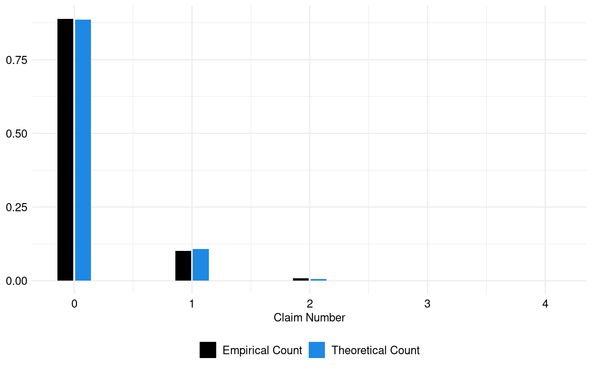
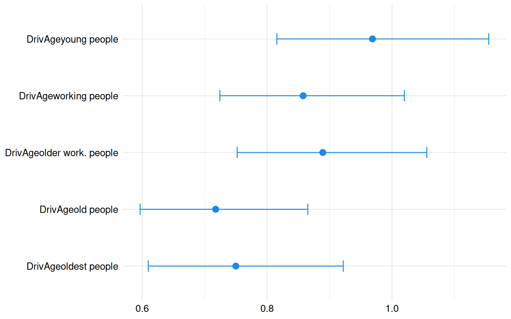
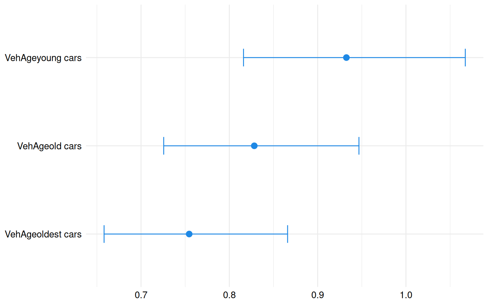

# Frequency analysis of an Australian Motor Third Party Liability dataset

## Introduction

Session Settings

``` r

# Graphs----
face_text='plain'
face_title='plain'
size_title = 14
size_text = 11
legend_size = 11

global_theme <- function() {
  theme_minimal() %+replace%
    theme(
      text = element_text(size = size_text, face = face_text),
      legend.position = "bottom",
      legend.direction = "horizontal", 
      legend.box = "vertical",
      legend.key = element_blank(),
      legend.text = element_text(size = legend_size),
      axis.text = element_text(size = size_text, face = face_text), 
      plot.title = element_text(
        size = size_title, 
        hjust = 0.5
      ),
      plot.subtitle = element_text(hjust = 0.5)
    )
}

# Outputs
options("digits" = 2)
```

> **In Brief**
>
> The objective of this vignette is to demonstrate the application of
> Quasi-Poisson regression in analyzing insurance data, specifically
> focusing on the `ausprivauto0405` dataset from Charpentier
> ([2014](#ref-charpentierCAS)). This dataset provides information on
> insurance contracts and claims related to Australian motor third-party
> liability insurance.
>
> By leveraging Quasi-Poisson regression, our goal is to model the
> frequency of claims and investigate the factors influencing claim
> occurrence within the insurance data.

### Required Packages

Show the code

``` r

required_libraries <- c(
  "tidyverse", 
  "CASdatasets",
  "MASS",
  "AER",
  "broom",
  "knitr",
  "kableExtra"
)
invisible(lapply(required_libraries, library, character.only = TRUE))
```

### Data

The data used in this vignette come from the Australian motor
third-party liability insurance portfolio.

The first dataset, `ausprivauto0405`, encompasses details regarding
contracts and clients obtained from an Australian insurance company,
related to some motor insurance portfolio. Third-party insurance is a
compulsory insurance for vehicle owners in Australia. It insures vehicle
owners against injury caused to other drivers, passengers, or
pedestrians as a result of an accident.

For clarity purposes, the `ausprivauto0405` table will be named
`CLAIMS`.

### Dictionaries

The list of the 9 variables from the `freMTPLfreq` dataset is reported
in [Table 1](#tbl-dict-ausprivauto).

| Attribute   | Type    | Description                           |
|-------------|---------|---------------------------------------|
| Exposure    | Numeric | The number of policy years            |
| VehValue    | Numeric | The vehicle value in thousands of AUD |
| VehAge      | Factor  | The vehicle age group                 |
| VehBody     | Factor  | The vehicle body group                |
| Gender      | Factor  | The gender of the policyholder        |
| DrivAge     | Numeric | The age of the policyholder           |
| ClaimOcc    | Factor  | Indicates occurrence of a claim       |
| ClaimNb     | Numeric | The number of claims                  |
| ClaimAmount | Numeric | The sum of claim payments             |

Table 1: Content of the `CLAIMS` dataset: ausprivauto0405

### Importation

Code for importing our datasets

``` r

data(ausprivauto0405)


CLAIMS <- ausprivauto0405 |>
  filter(Exposure > 0.70)

CLAIMS$VehAge <- CLAIMS$VehAge |> 
  factor(levels = c("youngest cars", "young cars", "old cars", "oldest cars"))


age_mapping <- c("youngest people" = 1, "young people" = 2, "working people" = 3,
                 "older work. people" = 4, "old people" = 5, "oldest people" = 6)

drivage_levels <- levels(CLAIMS$DrivAge)


CLAIMS$DrivAge <- CLAIMS$DrivAge |>
  levels() |>
  (\(drivage_levels) order(sapply(drivage_levels, function(x) age_mapping[x])))() |>
  (\(drivage_order) factor(CLAIMS$DrivAge, levels = drivage_levels[drivage_order]))()
```

## Models

### Purpose

In the domain of automobile insurance, Quasi-Poisson Regression emerges
as a potent tool for understanding and forecasting accident frequencies,
repair costs, and claims trends.

Through Quasi-Poisson Regression, insurers gain the ability to not only
anticipate forthcoming challenges but also refine pricing strategies and
ensure resilience in a dynamic landscape of risk.

> **Pay Attention**
>
> The results from QuasiPoisson regression models are valid if:  
>
> - the responses are independent.  
> - the responses are distributed according to a Poisson distribution
>   with parameter Lambda.  
> - There may be
>   [overdispersion](https://en.wikipedia.org/wiki/Overdispersion)
>   present in the data. Quasi-Poisson regression models are appropriate
>   for handling situations where the variance exceeds the mean in the
>   data.

In this analysis, we explore the relationship between the response
variable `ClaimNb` (the number of insurance claims) and the explanatory
variables `DrivAge` (driver age) and `VehAge` (vehicle age). This
modeling framework aligns with the principles outlined by Agresti
([2013](#ref-agresti)), a prominent figure in statistical methodology,
who emphasizes the significance of considering multiple explanatory
factors in regression analysis.

### Introduction to Quasi-Poisson Regression

To model the frequency of insurance claims, we employ a Quasi-Poisson
regression approach. The response variable, `ClaimNb`, represents the
count of insurance claims and is assumed to follow a Quasi-Poisson
distribution:

``` math
\text{ClaimNb} \sim \text{QuasiPoisson}(\lambda),
```

where $`\lambda`$ is the mean rate of claims. Unlike the standard
Poisson regression, the Quasi-Poisson model is particularly useful when
the data exhibits overdispersion—meaning the variance of `ClaimNb` is
greater than the mean. This model adjusts for this overdispersion,
ensuring that the estimates of variance are accurate, leading to more
reliable inferences.

### Model Specification

The Quasi-Poisson regression model relates $`\lambda`$ to a set of
predictor variables and an additional term accounting for exposure
through a logarithmic link function. The logarithmic link function
ensures that the predicted rate of claims is always positive, as
required by the Quasi-Poisson distribution. More precisely, the natural
logarithm of $`\lambda`$ is expressed as a linear combination of the
predictors:

``` math
\log(\lambda) = \beta_0 + \beta_1 \times \text{DrivAge} + \beta_2 \times \text{VehAge} + \log(\text{Exposure}),
```

### Explanation of the Model Components

- **$`\beta_0`$**: This is the intercept term, representing the log of
  the expected number of claims when all predictors are at their
  reference levels.
- **$`\beta_1`$**: The coefficient for `DrivAge`, representing the
  change in the log expected number of claims for each one-unit increase
  in the driver’s age.
- **$`\beta_2`$**: The coefficient for `VehAge`, indicating the change
  in the log expected number of claims for each one-unit increase in the
  vehicle’s age.
- **$`\log(\text{Exposure})`$**: An offset term to adjust for varying
  levels of exposure across observations. This could represent
  differences in policy duration, the amount of coverage, or other
  factors that influence the level of risk exposure.

#### Addressing Overdispersion

In many real-world datasets, especially in insurance claims data, the
variance often exceeds the mean, leading to overdispersion. The
Quasi-Poisson model accounts for this by introducing a dispersion
parameter $`\phi`$, which scales the variance:

``` math
\text{Var}(Y) = \phi \cdot \lambda,
```

where $`\phi > 1`$ indicates the presence of overdispersion. This
adjustment makes the model more robust and ensures that standard errors
and confidence intervals are correctly estimated.

#### Practical Applications

- **Risk Assessment**: By understanding the relationship between claim
  frequency and variables such as `DrivAge` and `VehAge`, insurers can
  more accurately assess risk levels across different policyholders.
- **Pricing Strategies**: The insights gained from the Quasi-Poisson
  regression model can inform pricing strategies, helping insurers set
  premiums that reflect the underlying risk more accurately.
- **Claims Management**: Identifying key factors that drive claim
  frequencies allows insurers to implement targeted interventions, such
  as promoting safer driving habits among younger drivers or encouraging
  the use of newer, safer vehicles.

#### Conclusion

The Quasi-Poisson regression model is a powerful tool for analyzing
insurance claims data, particularly when dealing with overdispersion. By
adjusting for the extra variability in the data, this model provides
more reliable and accurate estimates, which are crucial for effective
risk management and decision-making in the insurance industry.

The coefficients $`\beta_0`$, $`\beta_1`$, and $`\beta_2`$ are estimated
through regression to quantify their impact on the expected rate of
claims. This model not only improves the understanding of the factors
influencing claim frequencies but also enhances the insurer’s ability to
make informed decisions.

The estimated lambda parameter, which represents the mean of claims, is:
0.12.

``` r

set.seed(1234) 

theoretic_count <- rpois(nrow(CLAIMS), mean(CLAIMS$ClaimNb))

tc_df <- tibble(theoretic_count)

freq_theoretic <- prop.table(table(tc_df$theoretic_count))

freq_claim <- prop.table(table(CLAIMS$ClaimNb))

freq_theoretic_df <- tibble(
  Count = as.numeric(names(freq_theoretic)),
  Frequency = as.numeric(freq_theoretic),
  Source = "Theoretical Count"
)

freq_claim_df <- tibble(
  Count = as.numeric(names(freq_claim)),
  Frequency = as.numeric(freq_claim),
  Source = "Empirical Count"
)

freq_combined <- freq_theoretic_df |> 
  rbind(freq_claim_df)
```

The theoretical and empirical histograms associated with a Poisson
distribution are shown in [Figure 1](#fig-plot-hist-claims).

Code for the following graph

``` r

ggplot(freq_combined, aes(x = Count, y = Frequency, fill = Source)) +
  geom_bar(stat = "identity", position = "dodge2", width = 0.3) +
  labs(x = "Claim Number", y = "Frequency", fill = "Legend") +
  theme(legend.position = "right") +
  scale_fill_manual(
    NULL,
    values = c("Empirical Count" = "black", "Theoretical Count" = "#1E88E5")
  ) +
  labs(fill = "Legend") +
  labs(x = "Claim Number", y = NULL) +
  theme(legend.position = "right")+
  global_theme()
```



Figure 1: Theoretical and empirical histogram of claims in frequence

``` r

freg <- formula(ClaimNb ~ DrivAge + VehAge + offset(log(Exposure)))
  
reg <- glm(freg, family = quasipoisson, data = CLAIMS)

summary(reg)
```


    Call:
    glm(formula = freg, family = quasipoisson, data = CLAIMS)

    Coefficients:
                              Estimate Std. Error t value Pr(>|t|)
    (Intercept)                -1.6570     0.0868  -19.09  < 2e-16 ***
    DrivAgeyoung people        -0.0318     0.0887   -0.36  0.71960
    DrivAgeworking people      -0.1535     0.0872   -1.76  0.07823 .
    DrivAgeolder work. people  -0.1175     0.0865   -1.36  0.17424
    DrivAgeold people          -0.3317     0.0947   -3.50  0.00046 ***
    DrivAgeoldest people       -0.2878     0.1054   -2.73  0.00631 **
    VehAgeyoung cars           -0.0698     0.0684   -1.02  0.30743
    VehAgeold cars             -0.1885     0.0678   -2.78  0.00547 **
    VehAgeoldest cars          -0.2817     0.0700   -4.03  5.7e-05 ***
    ---
    Signif. codes:  0 '***' 0.001 '**' 0.01 '*' 0.05 '.' 0.1 ' ' 1

    (Dispersion parameter for quasipoisson family taken to be 1.1)

        Null deviance: 9444.4  on 17519  degrees of freedom
    Residual deviance: 9396.8  on 17511  degrees of freedom
    AIC: NA

    Number of Fisher Scoring iterations: 6

This is a Quasi-Poisson regression model predicting `ClaimNb` (number of
claims) using `DrivAge` (driver age) and `VehAge` (vehicle age) as
predictors. The model coefficients indicate the change in the log count
of claims associated with each predictor level compared to a reference
level.

For instance, as `DrivAge` transitions from the `youngest` category to
the `old people` category, the log count of claims decreases by 0.33.
This suggests that older drivers are associated with fewer claims
compared to younger drivers.

Similarly, as `VehAge` increases within each category, the log count of
claims also decreases, indicating that older vehicles tend to be
involved in fewer claims.

Most of the coefficients in the model are statistically significant.

- [Coefficients](#tabset-1-1)
- [Count-Ratio](#tabset-1-2)
- [Confidence intervals](#tabset-1-3)

&nbsp;

- Code to create the table
  ``` r

  reg_coef <- tidy(reg)


  reg_coef <- reg_coef |>
    mutate(significance = case_when(
      p.value < 0.001 ~ "***",
      p.value < 0.01 ~ "**",
      p.value < 0.05 ~ "*",
      p.value < 0.01 ~ ".",
      TRUE ~ ""
    ))

  kable(reg_coef, format = "html", escape = FALSE) |>
    kable_styling(full_width = FALSE) |>
    add_footnote(c("Significance levels: *** p < 0.001, ** p < 0.01, * p < 0.05, . p.value < 0.1"), notation = "none")
  ```

  | term | estimate | std.error | statistic | p.value | significance |
  |:---|---:|---:|---:|---:|:---|
  | (Intercept) | -1.66 | 0.09 | -19.09 | 0.00 | \*\*\* |
  | DrivAgeyoung people | -0.03 | 0.09 | -0.36 | 0.72 |  |
  | DrivAgeworking people | -0.15 | 0.09 | -1.76 | 0.08 |  |
  | DrivAgeolder work. people | -0.12 | 0.09 | -1.36 | 0.17 |  |
  | DrivAgeold people | -0.33 | 0.09 | -3.50 | 0.00 | \*\*\* |
  | DrivAgeoldest people | -0.29 | 0.11 | -2.73 | 0.01 | \*\* |
  | VehAgeyoung cars | -0.07 | 0.07 | -1.02 | 0.31 |  |
  | VehAgeold cars | -0.19 | 0.07 | -2.78 | 0.01 | \*\* |
  | VehAgeoldest cars | -0.28 | 0.07 | -4.03 | 0.00 | \*\*\* |
  |  Significance levels: \*\*\* p \< 0.001, \*\* p \< 0.01, \* p \< 0.05, . p.value \< 0.1 |  |  |  |  |  |

  Table 2: Coefficients

Code to create the table

``` r

reg_count_ratio <- tidy(exp(coef(reg)[-1]))

reg_count_ratio <- reg_count_ratio |>
  mutate(p.value = reg_coef$p.value[-1]) |>
  mutate(significance = case_when(
    p.value < 0.001 ~ "***",
    p.value < 0.01 ~ "**",
    p.value < 0.05 ~ "*",
    TRUE ~ ""
  )) |>
  dplyr::select(-p.value)

kable(reg_count_ratio, format = "html", escape = FALSE) |>
  kable_styling(full_width = FALSE) |>
  add_footnote(c("Significance levels: *** p < 0.001, ** p < 0.01, * p < 0.05"), notation = "none")
```

| names | x | significance |
|:---|---:|:---|
| DrivAgeyoung people | 0.97 |  |
| DrivAgeworking people | 0.86 |  |
| DrivAgeolder work. people | 0.89 |  |
| DrivAgeold people | 0.72 | \*\*\* |
| DrivAgeoldest people | 0.75 | \*\* |
| VehAgeyoung cars | 0.93 |  |
| VehAgeold cars | 0.83 | \*\* |
| VehAgeoldest cars | 0.75 | \*\*\* |
|  Significance levels: \*\*\* p \< 0.001, \*\* p \< 0.01, \* p \< 0.05 |  |  |

Table 3: Count Ratio

Each count ratio represents the change in the count of making a claim
associated with a one-unit increase in the predictor variable, compared
to the reference category `DrivAge youngest people`. For example, a
count ratio of -0.33 for `DrivAge old people` implies that the count of
making a claim for individuals considered as old is approximately 28%
lower compared to the reference category.

Similarly, count ratios below 1 for `VehAge` categories suggest a
decrease in the count of making a claim as the vehicle age increases.

Code to create the table

``` r

reg_conf_int <- as.data.frame(exp(confint(reg))[-1, ])
```

    Waiting for profiling to be done...

Code to create the table

``` r

colnames(reg_conf_int) <- c("2.5 %", "97.5 %")

reg_conf_int <- reg_conf_int |>
  mutate(p.value = reg_coef$p.value[-1]) |>
  mutate(significance = case_when(
    p.value < 0.001 ~ "***",
    p.value < 0.01 ~ "**",
    p.value < 0.05 ~ "*",
    TRUE ~ ""
  )) |>
  dplyr::select(-p.value)

kable(reg_conf_int, format = "html", escape = FALSE) |>
  kable_styling(full_width = FALSE) |>
  add_footnote(c("Significance levels : *** p < 0.001, ** p < 0.01, * p < 0.05"), notation = "none")
```

|  | 2.5 % | 97.5 % | significance |
|:---|---:|---:|:---|
| DrivAgeyoung people | 0.82 | 1.15 |  |
| DrivAgeworking people | 0.72 | 1.02 |  |
| DrivAgeolder work. people | 0.75 | 1.06 |  |
| DrivAgeold people | 0.60 | 0.87 | \*\*\* |
| DrivAgeoldest people | 0.61 | 0.92 | \*\* |
| VehAgeyoung cars | 0.82 | 1.07 |  |
| VehAgeold cars | 0.73 | 0.95 | \*\* |
| VehAgeoldest cars | 0.66 | 0.87 | \*\*\* |
|  Significance levels : \*\*\* p \< 0.001, \*\* p \< 0.01, \* p \< 0.05 |  |  |  |

Table 4: Confidence intervals

## Graphs

- [DriverAge](#tabset-2-1)
- [VehicleAge](#tabset-2-2)

&nbsp;

- Code to create the following graph
  ``` r

  count_ratio <- exp(coef(reg)[-1])
  conf_int <- exp(confint(reg))[-1, ]

  driver_age_vars <- grep("^DrivAge", names(count_ratio), value = TRUE)

  data_age <- tibble(
    variable = driver_age_vars,
    coefficient = count_ratio[driver_age_vars], 
    lower_bound = conf_int[driver_age_vars, 1], 
    upper_bound = conf_int[driver_age_vars, 2]
  )

  driver_vehage_vars <- grep("^VehAge", names(count_ratio), value = TRUE)

  data_vehage <- tibble(
    variable = driver_vehage_vars,
    coefficient = count_ratio[driver_vehage_vars], 
    lower_bound = conf_int[driver_vehage_vars, 1], 
    upper_bound = conf_int[driver_vehage_vars, 2]
  )

  data_age$variable <- factor(data_age$variable, levels = rev(driver_age_vars))

  ggplot(
    data_age, 
    aes(
      x = coefficient,
      y = variable,
      xmin = lower_bound,
      xmax = upper_bound
    )
  ) +
    geom_point(stat = "identity", size = 3, color = "#1E88E5") +
    geom_errorbar(
      width = 0.2,
      position = position_dodge(width = 0.6),
      color = "#1E88E5"
    ) +
    labs(
      x = NULL,
      y = NULL
    ) +
    global_theme()
  ```

  

  Figure 2: Count ratio and confidence interval of Driver Age

Code to create the following graph

``` r

data_vehage <- data_vehage |> 
  mutate(variable = reorder(variable, coefficient, decreasing = FALSE))

ggplot(
  data_vehage, 
  aes(
    x = coefficient,
    y = variable,
    xmin = lower_bound,
    xmax = upper_bound
  )
) +
  geom_point(
    stat = "identity",
    size = 3,
    color = "#1E88E5"
  ) +
  geom_errorbar(
    width = 0.2,
    position = position_dodge(width = 0.6),
    color = "#1E88E5"
  ) +
  labs(
    x = NULL,
    y = NULL
  ) +
  global_theme()
```



Figure 3: Count ratio and confidence interval of vehicle Age

## References

Agresti, Alan. 2013. *Categorical Data Analysis*. 3rd Edition. John
Wiley & Sons. <https://doi.org/10.1002/0471249688>.

Charpentier, Arthur. 2014. *Computational Actuarial Science with R*. The
R Series. Chapman; Hall/CRC.
<https://www.routledge.com/Computational-Actuarial-Science-with-R/Charpentier/p/book/9781138033788>.

## See also

For more similar claim frequency datasets with a Poisson-like
distribution, see
[`freMTPL`](https://dutangc.github.io/CASdatasets/reference/freMTPL.html)
(import with `data("freMTPLfreq")`): French automobile dataset,
[`norauto`](https://dutangc.github.io/CASdatasets/reference/norauto.html):
Norwegian automobile dataset (import with `data("norauto")`),
[`beMTPL16`](https://dutangc.github.io/CASdatasets/reference/beMTPL16.html):
Belgian automobile dataset (import with `data("beMTPL16")`), or
[`pg17trainpol`](https://dutangc.github.io/CASdatasets/reference/pricingame.html)
(import with `data("pg17trainpol")`).
