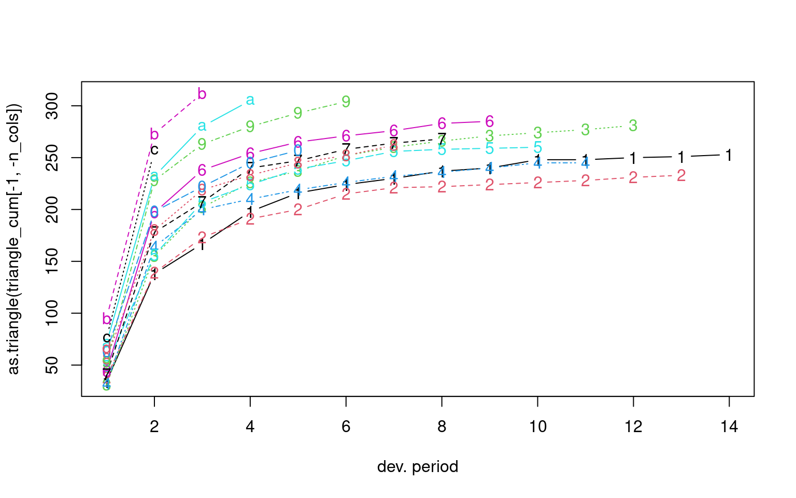
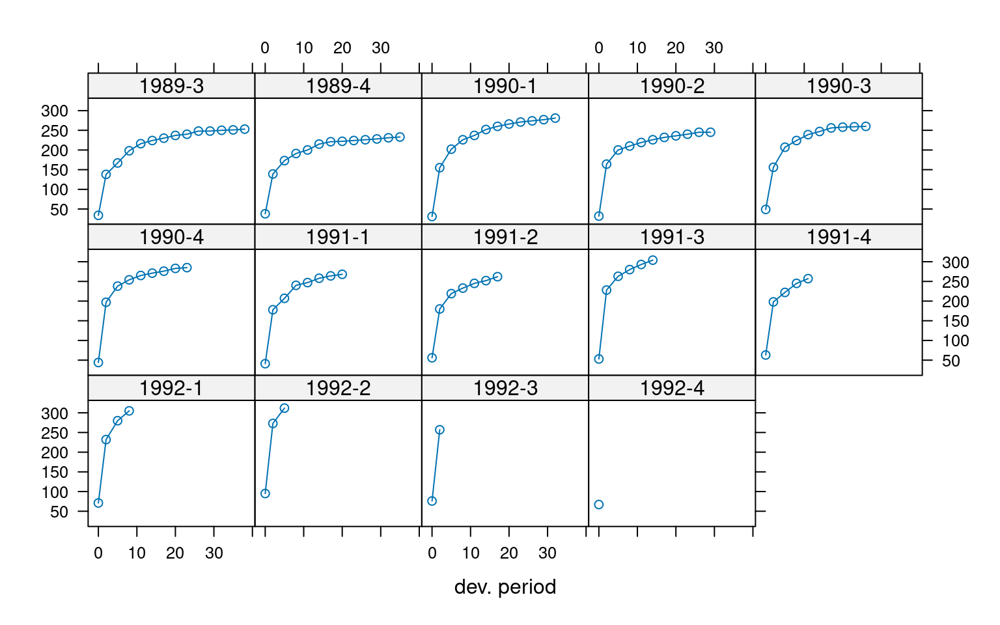

# Reserving exercice on reporting delays in AIDS Data

## Introduction

Session Settings

``` r

# Graphs----
face_text='plain'
face_title='plain'
size_title = 14
size_text = 11
legend_size = 11
```

> **In Brief**
>
> The reported number of Acquired Immune Deficiency Syndrome (AIDS)
> cases in England and Wales has recently been significantly
> underestimated due to substantial reporting delays. To address this
> issue, we will utilize the `Chainladder` package, specifically
> employing the `MackChainLadder` function.
>
> This analysis is crucial for accurately understanding the progression
> and impact of AIDS, which is essential for effective resource
> allocation and public health planning. By applying this method to AIDS
> reports in England and Wales from July 1983 to December 1992, we aim
> to adjust for reporting delays, thereby providing a more accurate
> picture of the epidemic’s evolution during this period.

### Required Packages

Show the code

``` r

required_libraries <- c(
  "tidyverse", 
  "tidyr",
  "ChainLadder",
  "boot",
  "dplyr"
)
invisible(lapply(required_libraries, library, character.only = TRUE))
```

### Data

The AIDS dataset consists of 570 rows and 6 columns, capturing critical
information about AIDS cases in England and Wales. Although all AIDS
cases are required to be reported to the Communicable Disease
Surveillance Centre, there is often a significant delay between
diagnosis and reporting. To accurately estimate the prevalence of AIDS,
it is essential to account for cases that have been diagnosed but not
yet reported.

This dataset, obtained from Angelis and Gilks
([1994](#ref-deangelis1994estimating)) and available in the `boot`
package, records reported AIDS cases from July 1983 through December
1992. The data is organized by both the date of diagnosis and the delay
in reporting, allowing for a more comprehensive analysis of the
reporting delays and their impact on understanding the true prevalence
of AIDS.

### Dictionaries

The list of the 6 attributes from the `aids` dataset is reported in
[Table 1](#tbl-dict-aids).

| Column Name | Description | Notes |
|----|----|----|
| year | The year in which the diagnosis was made. |  |
| quarter | The quarter of the year in which the diagnosis was made. | Values range from 1 to 4, representing Q1 to Q4. |
| delay | The time delay (in months) between diagnosis and reporting. | 0 indicates reporting within one month. Longer delays are grouped in 3-month intervals, with the value representing the midpoint of the interval (e.g., 2 means the report was delayed between 1 and 3 months). |
| dud | An indicator of censoring, where categories have incomplete information. | The recorded number is a lower bound only. |
| time | The number of quarters from July 1983 until the end of the quarter in which the cases were diagnosed. |  |
| y | The number of AIDS cases reported. |  |

Table 1: Content of the `aids`

### Importation and triangle transformation

Code for importing the dataset and transforming it into a triangle

``` r

data("aids")

aids_agg <- aids |>
  group_by(year, quarter, delay) |>
  summarise(cases = sum(y), .groups = 'drop') |>
  mutate(year_quarter = paste(year, quarter, sep = "-"))

# Create a data frame in long format
aids_long <- aids_agg |>
  select(year_quarter, delay, cases)

# Reshape the data into a wide format (triangle format)
triangle <- aids_long |>
  pivot_wider(names_from = delay,
              values_from = cases,
              values_fill = list(cases = 0)) |>
  arrange(year_quarter)

# Convert the wide format data frame to a matrix
  triangle_matrix <- as.matrix(triangle |>
  select(-year_quarter))  # Exclude the year_quarter column for matrix conversion

rownames(triangle_matrix) <- triangle$year_quarter

# Triangular shape
n_rows <- nrow(triangle_matrix)
n_cols <- ncol(triangle_matrix)
  
for (i in seq_len(n_cols-1)) {
    triangle_matrix[(n_rows - i + 1):n_rows, i+1] <- NA
}

full_rows <- which(rowSums(is.na(triangle_matrix)) == 0)
full_triangle <- triangle_matrix[full_rows, ]
close_data <- colSums(full_triangle, na.rm = TRUE)

triangle_rows <- which(rowSums(is.na(triangle_matrix)) != 0)

triangle_matrix_final <- rbind(close_data, triangle_matrix[triangle_rows, ])

# Convert matrix to a 'triangle' object for chainladder
triangle_cl <- as.triangle(triangle_matrix_final)

print(triangle_cl)
```

In this context, a triangle is a table used to display data over time,
organized across two dimensions:

- **Lines as Origin Year:** Represents the year when the diagnosis
  occurred.
- **Columns as Development Year:** Indicates the number of months
  (+/- 1) that have passed since the origin year.

This table structure is instrumental in tracking and analyzing the
progression of data from the time of origin over subsequent months. It
allows for a clear visualization of how cases develop and accumulate
over time, providing valuable insights for further analysis.

## Overview

### Purpose

The prediction and monitoring of the acquired immune deficiency syndrome
(AIDS) epidemic rely heavily on the availability of reliable and
complete data on AIDS diagnoses. However, a significant challenge in
this context is the considerable delay that often occurs between the
diagnosis of an AIDS case and its subsequent reporting to the epidemic
monitoring center. In England and Wales, this reporting process is
managed by the Public Health Laboratory Service AIDS Centre at the
Communicable Disease Surveillance Centre. To effectively utilize AIDS
reports, it is crucial to account for cases that have been diagnosed but
have not yet been reported.

To address this issue, we will employ the Mack chain ladder method, a
statistical tool originally developed for insurance claims forecasting.
The method is particularly well-suited for analyzing right-truncated
data, making it an ideal choice for correcting delays in reporting. The
Mack chain ladder method enables robust predictions of future case
reports by estimating the development pattern of reported cases over
time. This approach not only adjusts for the reporting delay but also
provides a measure of the uncertainty associated with these estimates.

By applying the Mack chain ladder method, we aim to achieve more
accurate and timely insights into the progression of the AIDS epidemic.
Enhanced prediction and monitoring capabilities are essential for
effective public health planning, resource allocation, and the
implementation of timely interventions to control the spread of the
disease. While various statistical techniques have been developed to
address this inferential challenge, the Mack chain ladder method is
distinguished by its reliability and practicality in handling
right-truncated data.

- [Claims development chart](#tabset-1-1)
- [Origin year plot](#tabset-1-2)

&nbsp;

- Show the code
  ``` r

  triangle_cum <- incr2cum(triangle_cl)
  print(triangle_cum)
  ```

                  dev
      origin         0    2    5    8   11   14   17   20   23   26   29   32   35
        close_data 355 1455 1784 2000 2134 2245 2328 2397 2451 2490 2526 2546 2553
        1989-3      34  138  167  198  216  224  230  237  240  248  248  250  251
        1989-4      38  139  173  191  200  215  221  222  224  226  228  231  233
        1990-1      31  155  202  226  237  252  260  266  271  274  277  281   NA
        1990-2      32  164  200  210  219  226  232  236  240  245  245   NA   NA
        1990-3      49  156  207  224  239  247  256  258  259  260   NA   NA   NA
        1990-4      44  197  238  254  265  271  276  283  285   NA   NA   NA   NA
        1991-1      41  178  207  240  247  258  264  268   NA   NA   NA   NA   NA
        1991-2      56  180  219  233  245  252  262   NA   NA   NA   NA   NA   NA
        1991-3      53  228  263  280  293  304   NA   NA   NA   NA   NA   NA   NA
        1991-4      63  198  222  245  257   NA   NA   NA   NA   NA   NA   NA   NA
        1992-1      71  232  280  305   NA   NA   NA   NA   NA   NA   NA   NA   NA
        1992-2      95  273  312   NA   NA   NA   NA   NA   NA   NA   NA   NA   NA
        1992-3      76  257   NA   NA   NA   NA   NA   NA   NA   NA   NA   NA   NA
        1992-4      67   NA   NA   NA   NA   NA   NA   NA   NA   NA   NA   NA   NA
                  dev
      origin         38   41
        close_data 2573 2626
        1989-3      253   NA
        1989-4       NA   NA
        1990-1       NA   NA
        1990-2       NA   NA
        1990-3       NA   NA
        1990-4       NA   NA
        1991-1       NA   NA
        1991-2       NA   NA
        1991-3       NA   NA
        1991-4       NA   NA
        1992-1       NA   NA
        1992-2       NA   NA
        1992-3       NA   NA
        1992-4       NA   NA

  Code to create the following graph
  ``` r

  ChainLadder::plot(as.triangle(triangle_cum[-1, -n_cols]))
  ```

  

  Figure 1: Claims development chart of the damage triangle, with one
  line per origin period.

Code to create the following graph

``` r

plot(as.triangle(triangle_cum[-1, -n_cols]), lattice=TRUE)
```



Figure 2: Claims development by origin year

## Mack chain-ladder

In 1993, Thomas Mack introduced a groundbreaking method in his paper
([Mack 1993](#ref-Mack_distributionfree1993)), which estimates the
standard errors of the chain-ladder forecast without assuming a specific
distribution, under three key conditions.

### The Mack Chain-Ladder Model

Following the notation established by Mack in 1999 ([Mack
1999](#ref-Mack1999)), let $`C_{ik}`$ denote the cumulative loss amounts
of origin period (e.g., accident year) $`i=1,\ldots,m`$, with losses
known for development period (e.g., development year) $`k \le n+1-i.`$

To forecast the amounts $`C_{ik}`$ for $`k > n+1-i`$, the Mack
chain-ladder model makes the following assumptions:

``` math
\begin{aligned}
  \text{CL1:} & \quad E[ F_{ik}| C_{i1},C_{i2},\ldots,C_{ik} ] = f_k
  \quad \text{where} \quad F_{ik} = \frac{C_{i,k+1}}{C_{ik}} \\
  \text{CL2:} & \quad Var\left( \frac{C_{i,k+1}}{C_{ik}} \Bigg| C_{i1},C_{i2}, \ldots,C_{ik} \right) = \frac{\sigma_k^2}{w_{ik} C_{ik}^\alpha} \\
  \text{CL3:} & \quad \{C_{i1},\ldots,C_{in}\} \text{ and } \{C_{j1},\ldots,C_{jn}\} \text{ are independent for origin periods } i \neq j
\end{aligned}
```

where $`w_{ik} \in [0,1]`$ and $`\alpha \in \{0,1,2\}`$ are parameters
that adjust the variance structure. If these assumptions hold, the Mack
chain-ladder model provides an unbiased estimator for Incurred But Not
Reported (IBNR) claims.

### Intuition Behind the Method

The Chain-Ladder model is a powerful tool used to project future claims
based on historical data. The core idea is that claims development
patterns are relatively stable and predictable. The model assumes that
the ratios of cumulative losses between successive development years are
consistent, allowing these ratios to be used in estimating future
losses.

#### Assumptions Explained:

1.  **CL1: Expected Future Ratio**  
    This assumption posits that the expected future ratio $`F_{ik}`$ of
    cumulative losses between successive development years is constant,
    given the known losses up to the current development year.
    Essentially, this means that the ratio of cumulative losses from one
    development year to the next is assumed to follow a consistent
    pattern, captured by a factor $`f_k`$.

2.  **CL2: Variance of Future Ratio**  
    Here, the model specifies that the variance of the future ratio of
    cumulative losses is proportional to
    $`\frac{\sigma_k^2}{w_{ik} C_{ik}^\alpha}`$. The term $`\sigma_k^2`$
    represents the variability, $`w_{ik}`$ is a weight, and $`\alpha`$
    is a parameter that adjusts for different variance levels. This
    assumption is crucial for quantifying the uncertainty around the
    forecasts.

3.  **CL3: Independence of Origin Periods**  
    This assumption ensures that cumulative loss amounts from different
    origin periods (e.g., different accident years) are independent.
    This independence simplifies the estimation process and increases
    the robustness of the model.

#### Practical Application

The Mack Chain-Ladder model can be viewed as a weighted linear
regression through the origin for each development period:

``` math
\text{lm}(y \sim x + 0, \text{weights} = w/x^{2-\alpha}),
```

where $`y`$ is the vector of claims at development period $`k+1`$ and
$`x`$ is the vector of claims at development period $`k`$.

The Mack method is implemented in the ChainLadder package via the
function `MackChainLadder`. This implementation enables actuaries to
perform robust reserving exercises, forecast future claims developments,
and maintain the financial stability of insurance companies by ensuring
they can meet their future claim obligations.

For a comprehensive understanding of this methodology, including its
practical implications and applications, see Gesmann
([2014](#ref-gesmann2014claims)).

As an example we apply the `MackChainLadder` function to our triangle
`Damage`:

``` r

mack <- MackChainLadder(triangle_cum, est.sigma="Mack")
mack # same as summary(mack) 
```

    MackChainLadder(Triangle = triangle_cum, est.sigma = "Mack")

               Latest Dev.To.Date Ultimate   IBNR Mack.S.E CV(IBNR)
    close_data  2,626       1.000    2,626   0.00  0.00000      NaN
    1989-3        253       0.980      258   5.21  0.00112 0.000215
    1989-4        233       0.972      240   6.67  0.03291 0.004938
    1990-1        281       0.969      290   8.99  1.10632 0.123017
    1990-2        245       0.960      255  10.08  1.57793 0.156584
    1990-3        260       0.949      274  13.88  3.06281 0.220653
    1990-4        285       0.935      305  19.94  4.42964 0.222143
    1991-1        268       0.918      292  23.97  5.23819 0.218506
    1991-2        262       0.896      292  30.45  6.32616 0.207725
    1991-3        304       0.867      351  46.59  7.51700 0.161331
    1991-4        257       0.829      310  53.12  8.71038 0.163967
    1992-1        305       0.783      390  84.52 11.62803 0.137573
    1992-2        312       0.708      441 128.97 18.94355 0.146883
    1992-3        257       0.584      440 183.05 26.87186 0.146798
    1992-4         67       0.153      437 369.56 80.76600 0.218545

                Totals
    Latest:   6,215.00
    Dev:          0.86
    Ultimate: 7,200.02
    IBNR:       985.02
    Mack.S.E     92.13
    CV(IBNR):     0.09

``` r

# Displaying the Mack model's parameters
mack$f
```

     [1] 3.805395 1.211481 1.106679 1.058359 1.046333 1.033174 1.024588 1.018210
     [9] 1.015739 1.011771 1.008844 1.003304 1.007846 1.020599 1.000000

``` r

# Viewing the full triangle data from the Mack model
mack$FullTriangle
```

                dev
    origin         0         2         5         8        11        14        17
      close_data 355 1455.0000 1784.0000 2000.0000 2134.0000 2245.0000 2328.0000
      1989-3      34  138.0000  167.0000  198.0000  216.0000  224.0000  230.0000
      1989-4      38  139.0000  173.0000  191.0000  200.0000  215.0000  221.0000
      1990-1      31  155.0000  202.0000  226.0000  237.0000  252.0000  260.0000
      1990-2      32  164.0000  200.0000  210.0000  219.0000  226.0000  232.0000
      1990-3      49  156.0000  207.0000  224.0000  239.0000  247.0000  256.0000
      1990-4      44  197.0000  238.0000  254.0000  265.0000  271.0000  276.0000
      1991-1      41  178.0000  207.0000  240.0000  247.0000  258.0000  264.0000
      1991-2      56  180.0000  219.0000  233.0000  245.0000  252.0000  262.0000
      1991-3      53  228.0000  263.0000  280.0000  293.0000  304.0000  314.0850
      1991-4      63  198.0000  222.0000  245.0000  257.0000  268.9076  277.8284
      1992-1      71  232.0000  280.0000  305.0000  322.7993  337.7556  348.9604
      1992-2      95  273.0000  312.0000  345.2840  365.4343  382.3659  395.0506
      1992-3      76  257.0000  311.3507  344.5654  364.6737  381.5701  394.2284
      1992-4      67  254.9615  308.8810  341.8323  361.7811  378.5435  391.1014
                dev
    origin              20        23        26        29        32        35
      close_data 2397.0000 2451.0000 2490.0000 2526.0000 2546.0000 2553.0000
      1989-3      237.0000  240.0000  248.0000  248.0000  250.0000  251.0000
      1989-4      222.0000  224.0000  226.0000  228.0000  231.0000  233.0000
      1990-1      266.0000  271.0000  274.0000  277.0000  281.0000  281.9283
      1990-2      236.0000  240.0000  245.0000  245.0000  247.1668  247.9834
      1990-3      258.0000  259.0000  260.0000  263.0606  265.3871  266.2639
      1990-4      283.0000  285.0000  289.4858  292.8934  295.4838  296.4600
      1991-1      268.0000  272.8802  277.1752  280.4380  282.9182  283.8529
      1991-2      268.4421  273.3304  277.6325  280.9006  283.3849  284.3211
      1991-3      321.8077  327.6678  332.8251  336.7429  339.7212  340.8435
      1991-4      284.6597  289.8432  294.4052  297.8708  300.5052  301.4980
      1992-1      357.5407  364.0514  369.7814  374.1343  377.4432  378.6901
      1992-2      404.7642  412.1348  418.6216  423.5494  427.2954  428.7070
      1992-3      403.9218  411.2771  417.7504  422.6679  426.4061  427.8147
      1992-4      400.7178  408.0148  414.4368  419.3153  423.0238  424.4213
                dev
    origin              38        41
      close_data 2573.0000 2626.0000
      1989-3      253.0000  258.2114
      1989-4      234.8281  239.6652
      1990-1      284.1403  289.9932
      1990-2      249.9290  255.0772
      1990-3      268.3530  273.8806
      1990-4      298.7860  304.9405
      1991-1      286.0800  291.9728
      1991-2      286.5519  292.4544
      1991-3      343.5177  350.5936
      1991-4      303.8635  310.1226
      1992-1      381.6613  389.5229
      1992-2      432.0706  440.9706
      1992-3      431.1713  440.0528
      1992-4      427.7513  436.5623

The Mack model factors start at 3.8 for the initial periods and
gradually decrease to around 1 in the later periods. These factors
represent the development factors for each period, indicating the
expected growth in cumulative reports from one period to the next. This
trend reflects the typical pattern where most reports occur early in the
development process, with the rate of increase diminishing over time.

The triangular data illustrates how reports develop over time for each
origin period. For instance, in the 4th quarter of 1992, the number of
reported cases of acquired immune deficiency syndrome (AIDS) begins at
67 in the 1st period and grows to 437 cases by the 41st period.

Overall, this output offers a comprehensive view of how reports develop
over time and highlights the associated development factors used in the
chain ladder method.

## References

Angelis, D. De, and W. R. Gilks. 1994. “Estimating Acquired Immune
Deficiency Syndrome Accounting for Reporting Delay.” *Journal of the
Royal Statistical Society, A* 157: 31–40.

Gesmann, Markus. 2014. “Claims Reserving and IBNR.” In *Computational
Actuarial Science with R*. Chapman; Hall/CRC.

Mack, T. 1993. “Distribution-Free Calculation of the Standard Error of
Chain-Ladder Reserve Estimates.” *ASTIN Bulletin* 23 (2): 213–25.

Mack, T. 1999. “The Standard Error of Chain-Ladder Reserve Estimates:
Recursive Calculation and Inclusion of a Tail-Factor.” *ASTIN Bulletin*
29: 361–66.

## See also

For more similar triangles datasets, see
[`nortritpl8800`](https://dutangc.github.io/CASdatasets/reference/nortritpl.html)
(import with `data("ausprivauto0405")`): Australian liabilty insurance
triangles dataset,
[`sgautoprop9701`](https://dutangc.github.io/CASdatasets/reference/sgtriangles.html):
Singapore general liability triangles dataset (import with
`data("norauto")`),
[`swtri1auto`](https://dutangc.github.io/CASdatasets/reference/swtriangles.html):
Switzerland general liability triangles dataset (import with
`data("beMTPL16")`), or
[`usautotri9504`](https://dutangc.github.io/CASdatasets/reference/usautotri.html)
(import with `data("pg17trainpol")`): US Automobile triangles dataset.
