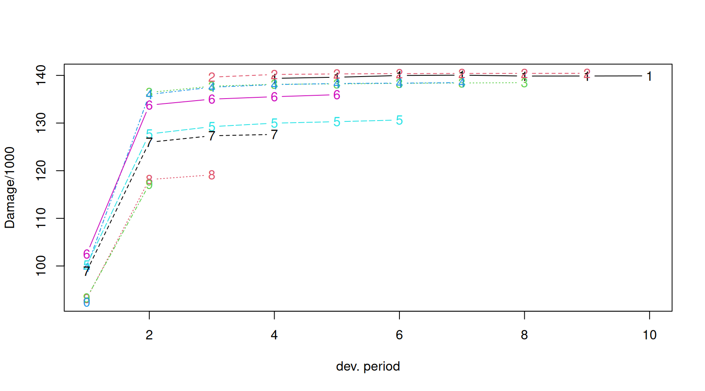
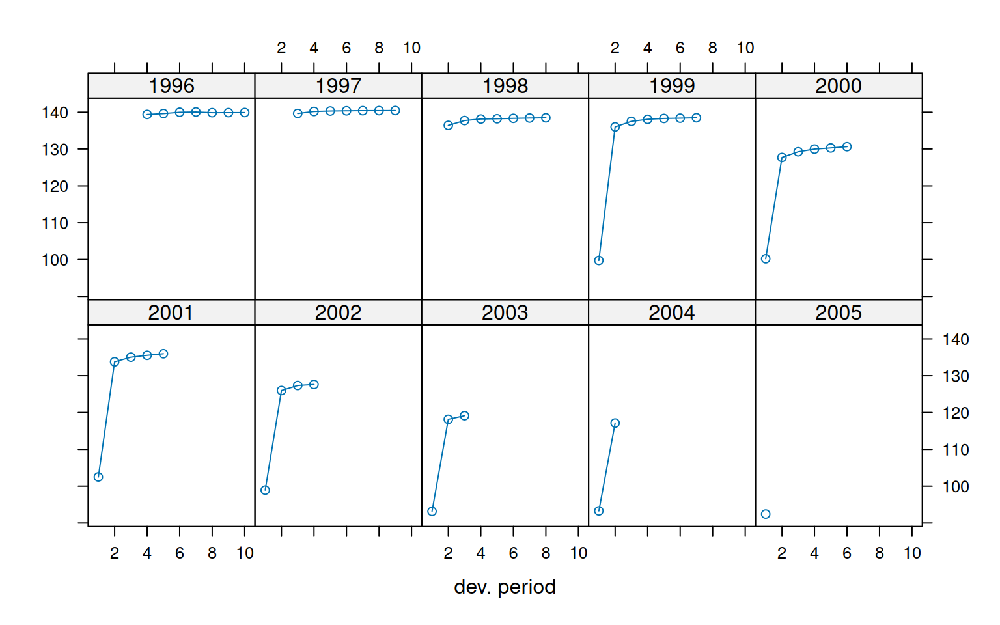
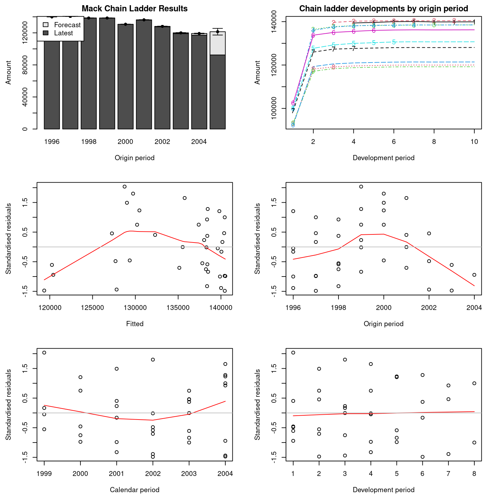
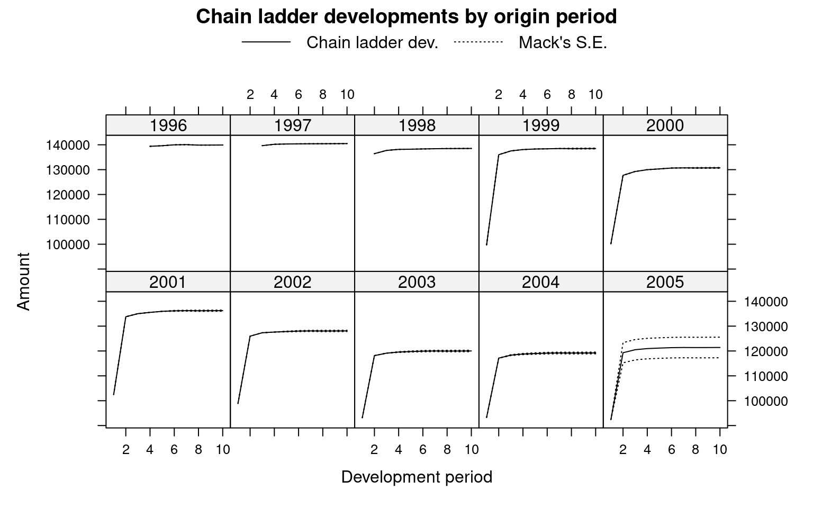

# Claims reserving of a French Motor Third Party Liability triangle dataset

## Introduction

Session Settings

``` r
# Graphs----
face_text='plain'
face_title='plain'
size_title = 14
size_text = 11
legend_size = 11
```

> **In Brief**
>
> The purpose of this vignette is to illustrate a reserving exercise
> aimed at forecasting future claims development, with a particular
> focus on the bottom right corner of the claims triangle and potential
> further developments. These estimates are crucial for maintaining the
> financial stability of insurance companies, ensuring that they can
> meet their future claim obligations.
>
> In this analysis, we will utilize the `fretri1auto9605` dataset from
> Charpentier ([2014](#ref-charpentierCAS)) and apply techniques from
> the `Chainladder` package to perform the reserving exercise.

### Required Packages

Show the code

``` r
required_libraries <- c(
  "tidyverse", 
  "CASdatasets",
  "ChainLadder"
)
invisible(lapply(required_libraries, library, character.only = TRUE))
```

### Data

The dataset `fretri1auto9605` comprises claim triangles for motor
policies from a French non-life insurer, spanning the years 1996 to
2005.

In this context, a triangle is a table used to display data over time,
structured across two key dimensions:

- **Origin Year (Rows):** Represents the year in which the claim
  occurred.
- **Development Year (Columns):** Indicates the number of years that
  have elapsed since the origin year.

This table format is instrumental in tracking and analyzing how claims
data evolves from the time of origin across subsequent years.

The `fretri1auto9605` dataset includes the following elements:

- **Damage Guarantee**
- **Bodily Injury Guarantee**
- **Total**

Each of these elements includes two types of triangles:

- **Paid Claims:** These triangles display cumulative claim amounts. For
  each development year, the amount shown includes all claims paid up to
  that point. As time progresses, the cumulative total increases or
  remains the same, reflecting the ongoing addition of payments.

- **Incurred Claim Amounts:** These triangles represent the total
  estimated amount for claims that have occurred but are not yet fully
  paid. Unlike paid claims, the incurred amounts are not cumulative.
  They represent the estimated total cost of claims for a specific
  development year and can be adjusted based on new information or
  revisions. Consequently, the incurred amounts may fluctuate over time
  and do not necessarily follow a simple increasing trend.

In this vignette, we will focus on the triangle representing the paid
damage claim amounts, referred to as `Damage`.

### Dictionaries

The list of the 3 elements from the `fretri1auto9605` dataset is
reported in [Table 1](#tbl-dict-fretri1auto9605).

| Elements | Description                                               |
|----------|-----------------------------------------------------------|
| damage   | Represents the damage guarantee for the insurance policy. |
| body     | Represents the body guarantee for the insurance policy.   |
| total    | Represents the total guarantee.                           |

Table 1: Content of the `fretri1auto9605`

The list of the 2 triangles in each elements is reported in
[Table 2](#tbl-dict-triangle).

| Triangle | Description                                                                                           |
|----------|-------------------------------------------------------------------------------------------------------|
| paid     | Shows the cumulative amount of claims paid up to each development period.                             |
| incur    | Represents the estimated total amount for claims that have occurred but are not necessarily paid yet. |

Table 2: Content in each triangle

### Importation

Code for importing our dataset

``` r
data(fretri1auto9605)

Damage <- fretri1auto9605$damage$paid|>
  as.triangle()
```

## Overview

### Purpose

Unlike other industries, the insurance sector sells promises rather than
tangible products. An insurance policy represents a commitment by the
insurer to cover future claims in exchange for a premium paid upfront.

This unique business model means that insurers do not know the exact
cost of their services in advance. Instead, they rely on historical data
analysis and expert judgment to set a sustainable price for their
offerings. In General Insurance (or Non-Life Insurance, which includes
motor, property, and casualty insurance), most policies are valid for a
period of 12 months. However, the process of settling claims can extend
over several years or even decades. Consequently, insurers often face
uncertainty regarding the timing of when claims will be settled.

For example, following a major natural disaster such as an earthquake,
the volume of claims can be overwhelming for an insurance company.
Assessing the damage to properties, businesses, and personal belongings
can be a complex and time-consuming process. Additionally, some claims
may require detailed investigations to determine coverage and validate
their legitimacy. In such situations, the delay in settlements can be
significant, as insurers need time to thoroughly evaluate each claim and
ensure accurate payouts.

To forecast future claims and manage pricing effectively, insurers
employ methods like chain ladder models. These models are essential
tools that estimate future claims based on historical data, helping
insurers anticipate upcoming challenges. By using chain ladder models,
insurers can provide reliable forecasts, refine pricing strategies, and
maintain resilience in a dynamic risk landscape.

In this vignette, we will demonstrate the application of chain ladder
models to forecast future claims development using the `fretri1auto9605`
dataset. This approach will highlight how these models can enhance
decision-making in the insurance industry.

For additional insights and a deeper understanding of claims reserving,
refer to Gesmann ([2014](#ref-gesmann2014claims)).

- [Data overview](#tabset-1-1)
- [Claims development chart](#tabset-1-2)
- [Origin year plot](#tabset-1-3)

&nbsp;

- Show the code
  ``` r
  print(Damage)
  ```

            dev
      origin         1        2        3        4        5        6        7        8
        1996        NA       NA       NA 139388.2 139619.7 139982.5 140052.8 139867.0
        1997        NA       NA 139650.2 140195.5 140315.7 140374.0 140411.0 140423.4
        1998        NA 136427.9 137736.1 138144.2 138219.5 138330.9 138413.8 138475.9
        1999  99741.09 136010.6 137524.4 138070.8 138303.9 138380.3 138486.1       NA
        2000 100206.10 127709.8 129251.7 129982.1 130291.3 130640.1       NA       NA
        2001 102502.50 133767.4 135024.4 135528.1 135956.1       NA       NA       NA
        2002  98919.46 125973.4 127334.7 127613.5       NA       NA       NA       NA
        2003  93163.87 118141.8 119127.6       NA       NA       NA       NA       NA
        2004  93283.37 117132.5       NA       NA       NA       NA       NA       NA
        2005  92422.10       NA       NA       NA       NA       NA       NA       NA
            dev
      origin        9       10
        1996 139878.6 139904.6
        1997 140449.0       NA
        1998       NA       NA
        1999       NA       NA
        2000       NA       NA
        2001       NA       NA
        2002       NA       NA
        2003       NA       NA
        2004       NA       NA
        2005       NA       NA

Code to create the following graph

``` r
ChainLadder::plot(Damage/1000)
```



Figure 1: Claims development chart of the damage triangle, with one line
per origin period.

Code to create the following graph

``` r
plot(Damage/1000, lattice=TRUE)
```



Figure 2: Claims development by origin year

## Mack chain-ladder

In 1993, Thomas Mack introduced a groundbreaking method in his paper
([Mack 1993](#ref-Mack_distributionfree1993)), which estimates the
standard errors of the chain-ladder forecast without assuming a specific
distribution, under three key conditions.

### The Mack Chain-Ladder Model

Following the notation established by Mack in 1999 ([Mack
1999](#ref-Mack1999)), let $C_{ik}$ denote the cumulative loss amounts
of origin period (e.g., accident year) $i = 1,\ldots,m$, with losses
known for development period (e.g., development year)
$k \leq n + 1 - i.$

To forecast the amounts $C_{ik}$ for $k > n + 1 - i$, the Mack
chain-ladder model makes the following assumptions:

$$\begin{aligned}
\text{CL1:} & {\quad E\lbrack F_{ik}|C_{i1},C_{i2},\ldots,C_{ik}\rbrack = f_{k}\quad\text{where}\quad F_{ik} = \frac{C_{i,k + 1}}{C_{ik}}} \\
\text{CL2:} & {\quad Var\left( \frac{C_{i,k + 1}}{C_{ik}}\left| C_{i1},C_{i2},\ldots,C_{ik} \right) \right. = \frac{\sigma_{k}^{2}}{w_{ik}C_{ik}^{\alpha}}} \\
\text{CL3:} & {\quad\{ C_{i1},\ldots,C_{in}\}{\mspace{6mu}\text{and}\mspace{6mu}}\{ C_{j1},\ldots,C_{jn}\}{\mspace{6mu}\text{are independent for origin periods}\mspace{6mu}}i \neq j}
\end{aligned}$$

where $w_{ik} \in \lbrack 0,1\rbrack$ and $\alpha \in \{ 0,1,2\}$ are
parameters that adjust the variance structure. If these assumptions
hold, the Mack chain-ladder model provides an unbiased estimator for
Incurred But Not Reported (IBNR) claims.

### Intuition Behind the Method

The Chain-Ladder model is a powerful tool used to project future claims
based on historical data. The core idea is that claims development
patterns are relatively stable and predictable. The model assumes that
the ratios of cumulative losses between successive development years are
consistent, allowing these ratios to be used in estimating future
losses.

#### Assumptions Explained:

1.  **CL1: Expected Future Ratio**  
    This assumption posits that the expected future ratio $F_{ik}$ of
    cumulative losses between successive development years is constant,
    given the known losses up to the current development year.
    Essentially, this means that the ratio of cumulative losses from one
    development year to the next is assumed to follow a consistent
    pattern, captured by a factor $f_{k}$.

2.  **CL2: Variance of Future Ratio**  
    Here, the model specifies that the variance of the future ratio of
    cumulative losses is proportional to
    $\frac{\sigma_{k}^{2}}{w_{ik}C_{ik}^{\alpha}}$. The term
    $\sigma_{k}^{2}$ represents the variability, $w_{ik}$ is a weight,
    and $\alpha$ is a parameter that adjusts for different variance
    levels. This assumption is crucial for quantifying the uncertainty
    around the forecasts.

3.  **CL3: Independence of Origin Periods**  
    This assumption ensures that cumulative loss amounts from different
    origin periods (e.g., different accident years) are independent.
    This independence simplifies the estimation process and increases
    the robustness of the model.

#### Practical Application

The Mack Chain-Ladder model can be viewed as a weighted linear
regression through the origin for each development period:

$$\text{lm}(y \sim x + 0,\text{weights} = w/x^{2 - \alpha}),$$

where $y$ is the vector of claims at development period $k + 1$ and $x$
is the vector of claims at development period $k$.

The Mack method is implemented in the ChainLadder package via the
function `MackChainLadder`. This implementation enables actuaries to
perform robust reserving exercises, forecast future claims developments,
and maintain the financial stability of insurance companies by ensuring
they can meet their future claim obligations.

For a comprehensive understanding of this methodology, including its
practical implications and applications, see Gesmann
([2014](#ref-gesmann2014claims)).

As an example we apply the `MackChainLadder` function to our triangle
`Damage`:

``` r
mack <- MackChainLadder(Damage, est.sigma="Mack")
mack # same as summary(mack) 
```

    MackChainLadder(Triangle = Damage, est.sigma = "Mack")

          Latest Dev.To.Date Ultimate      IBNR Mack.S.E CV(IBNR)
    1996 139,905       1.000  139,905      0.00     0.00      NaN
    1997 140,449       1.000  140,475     26.18     1.06   0.0405
    1998 138,476       1.000  138,520     44.15    12.08   0.2736
    1999 138,486       1.000  138,494      7.38   150.98  20.4724
    2000 130,640       0.999  130,716     76.37   149.00   1.9510
    2001 135,956       0.998  136,225    269.20   227.56   0.8453
    2002 127,614       0.996  128,084    470.21   258.49   0.5497
    2003 119,128       0.993  120,013    885.58   293.16   0.3310
    2004 117,133       0.983  119,212  2,079.24   341.87   0.1644
    2005  92,422       0.761  121,413 28,991.18 4,143.13   0.1429

                    Totals
    Latest:   1,280,207.64
    Dev:              0.97
    Ultimate: 1,313,057.12
    IBNR:        32,849.48
    Mack.S.E      4,227.78
    CV(IBNR):         0.13

``` r
# Displaying the Mack model's parameters
mack$f
```

     [1] 1.2907697 1.0102412 1.0037355 1.0017012 1.0013946 1.0005313 0.9997345
     [8] 1.0001324 1.0001864 1.0000000

``` r
# Viewing the full triangle data from the Mack model
mack$FullTriangle
```

          dev
    origin         1        2        3        4        5        6        7        8
      1996        NA       NA       NA 139388.2 139619.7 139982.5 140052.8 139867.0
      1997        NA       NA 139650.2 140195.5 140315.7 140374.0 140411.0 140423.4
      1998        NA 136427.9 137736.1 138144.2 138219.5 138330.9 138413.8 138475.9
      1999  99741.09 136010.6 137524.4 138070.8 138303.9 138380.3 138486.1 138449.4
      2000 100206.10 127709.8 129251.7 129982.1 130291.3 130640.1 130709.5 130674.8
      2001 102502.50 133767.4 135024.4 135528.1 135956.1 136145.7 136218.0 136181.9
      2002  98919.46 125973.4 127334.7 127613.5 127830.6 128008.9 128076.9 128042.9
      2003  93163.87 118141.8 119127.6 119572.6 119776.0 119943.1 120006.8 119974.9
      2004  93283.37 117132.5 118332.1 118774.1 118976.2 119142.1 119205.4 119173.8
      2005  92422.10 119295.6 120517.4 120967.6 121173.4 121342.3 121406.8 121374.6
          dev
    origin        9       10
      1996 139878.6 139904.6
      1997 140449.0 140475.2
      1998 138494.2 138520.1
      1999 138467.7 138493.5
      2000 130692.1 130716.5
      2001 136199.9 136225.3
      2002 128059.9 128083.7
      2003 119990.8 120013.2
      2004 119189.6 119211.8
      2005 121390.7 121413.3

The Mack model development factors begin at approximately 1.3 for the
initial periods and gradually decrease to around 1 for the later
periods. These factors represent the development factors for each
period, indicating the expected growth in cumulative claims from one
period to the next. This trend reflects the typical pattern observed in
insurance claims, where most claims are reported early in the
development process, and the rate of increase diminishes over time as
claims stabilize.

The triangular data illustrates how claims evolve over time for each
origin period. For instance, considering the origin year 2005, the
claims start at 92 422 in the 1st period and increase to 121 413 by the
10th period. This progression is crucial for actuaries when predicting
future claims and setting appropriate reserves.

Overall, this output provides a comprehensive view of the claims
development process over time and the development factors employed in
the chain ladder method. These insights are invaluable for ensuring
accurate forecasting and maintaining the financial health of insurance
companies.

## Graphs

- [Model’s Plot](#tabset-2-1)
- [Lattice plot](#tabset-2-2)

&nbsp;

- **Pay Attention**
  >
  > To check that Mack’s assumption are valid, review the residual
  > plots, we should see no trends in either of them.

  Code to create the following graph
  ``` r
  plot(mack)
  ```

  

  Figure 3: MackPlot

  There are no apparent trend so the model is valid.

We can plot the development, including the forecast and estimated
standard errors by origin period by setting the argument `lattice=TRUE`.

Code to create the following graph

``` r
plot(mack, lattice=TRUE)
```



Figure 4: MackPlot Lattice

## References

Charpentier, Arthur. 2014. *Computational Actuarial Science with R*. The
R Series. Chapman; Hall/CRC.
<https://www.routledge.com/Computational-Actuarial-Science-with-R/Charpentier/p/book/9781138033788>.

Gesmann, Markus. 2014. “Claims Reserving and IBNR.” In *Computational
Actuarial Science with R*. Chapman; Hall/CRC.

Mack, T. 1993. “Distribution-Free Calculation of the Standard Error of
Chain-Ladder Reserve Estimates.” *ASTIN Bulletin* 23 (2): 213–25.

Mack, T. 1999. “The Standard Error of Chain-Ladder Reserve Estimates:
Recursive Calculation and Inclusion of a Tail-Factor.” *ASTIN Bulletin*
29: 361–66.

## See also

For more similar triangles datasets, see
[`nortritpl8800`](https://dutangc.github.io/CASdatasets/reference/nortritpl.html)
(import with `data("ausprivauto0405")`): Australian liabilty insurance
triangles dataset,
[`sgautoprop9701`](https://dutangc.github.io/CASdatasets/reference/sgtriangles.html):
Singapore general liability triangles dataset (import with
`data("norauto")`),
[`swtri1auto`](https://dutangc.github.io/CASdatasets/reference/swtriangles.html):
Switzerland general liability triangles dataset (import with
`data("beMTPL16")`), or
[`usautotri9504`](https://dutangc.github.io/CASdatasets/reference/usautotri.html)
(import with `data("pg17trainpol")`): US Automobile triangles dataset.
