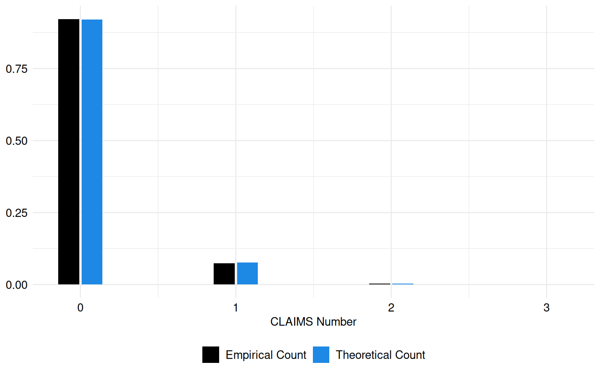
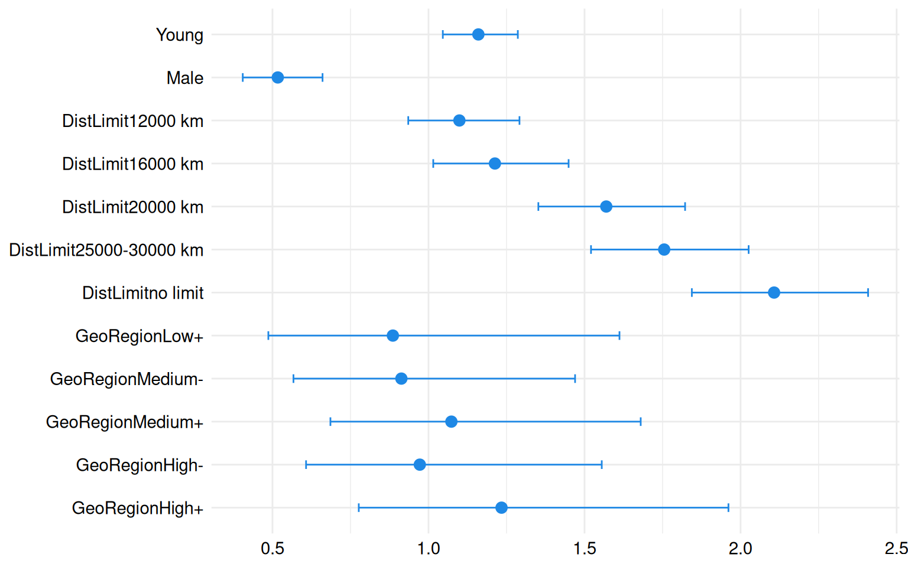
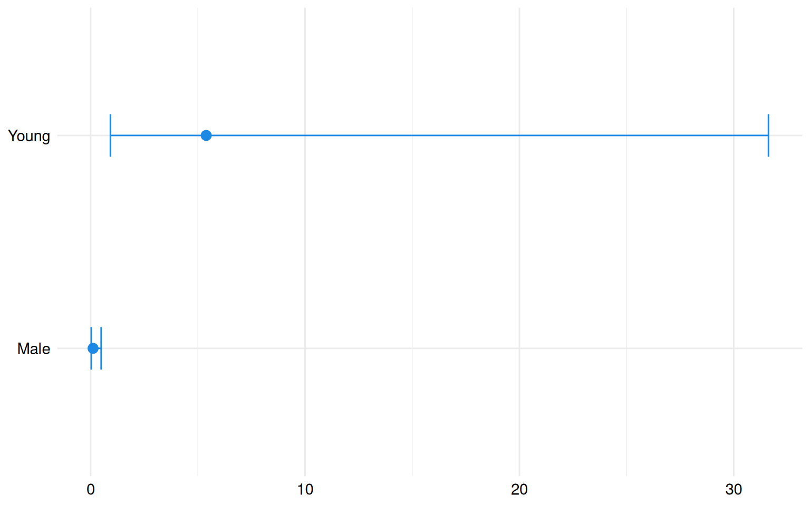

# Frequency analysis of a Norwegian Motor Third Party Liability dataset

## Introduction

Session Settings

``` r

# Graphs----
face_text='plain'
face_title='plain'
size_title = 14
size_text = 11
legend_size = 11

global_theme <- function() {
  theme_minimal() %+replace%
    theme(
      text = element_text(size = size_text, face = face_text),
      legend.position = "bottom",
      legend.direction = "horizontal", 
      legend.box = "vertical",
      legend.key = element_blank(),
      legend.text = element_text(size = legend_size),
      axis.text = element_text(size = size_text, face = face_text), 
      plot.title = element_text(
        size = size_title, 
        hjust = 0.5
      ),
      plot.subtitle = element_text(hjust = 0.5)
    )
}

# Outputs
options("digits" = 2)
```

> **In Brief**
>
> In some instances, zeros appear in the data. A simple Poisson model
> overlooks this specific structure, leading to inaccurate estimates. To
> resolve this issue, we employ zero-inflated regression models.
>
> The purpose of this vignette is to demonstrate the application of
> zero-inflated regression in analyzing insurance data, with a
> particular focus on the `norauto` dataset from Charpentier
> ([2014](#ref-charpentierCAS)). This dataset contains information on
> insurance contracts and claims related to Norwegian motor third-party
> liability insurance. By using zero-inflated regression, we aim to
> model the frequency of claims and explore the factors influencing
> claim occurrences within the insurance data.

### Required Packages

Show the code

``` r

required_libraries <- c(
  "tidyverse", 
  "CASdatasets",
  "pscl",
  "AER",
  "broom",
  "knitr",
  "kableExtra"
)
invisible(lapply(required_libraries, library, character.only = TRUE))
```

### Data

The data used in this vignette come from the motor third-party liability
insurance portfolio of a Norwegian insurer, `norauto`.

The `norauto` dataset, encompasses details regarding contracts and
clients obtained from a Norwegian insurance company, related to a motor
insurance portfolio. Third-party insurance insures vehicle owners
against injury caused to other drivers, passengers, or pedestrians as a
result of an accident.

For convenience, the `norauto` table will be named `CLAIMS`.

### Dictionaries

The list of the 9 variables from the `freMTPLfreq` dataset is reported
in [Table 1](#tbl-dict-norauto).

| Attribute | Type | Description |
|----|----|----|
| Male | Factor | 1 if the policyholder is a male, 0 otherwise |
| Young | Factor | 1 if the policyholder age is below 26 years, 0 otherwise |
| DistLimit | Factor | The distance limit as stated in the insurance contract: “8000 km”, “12000 km”, “16000 km”, “20000 km”, “25000-30000 km”, “no limit” |
| GeoRegion | Factor | Density of the geographical region (from heaviest to lightest): “High+”, “High-”, “Medium+”, “Medium-”, “Low+”, “Low-” |
| Expo | Numeric | Exposure as a fraction of year |
| ClaimAmount | Numeric | 0 or the average CLAIMS amount if NbClaim \> 0 |
| NbClaim | Numeric | The CLAIMS number |

Table 1: Content of the `CLAIMS` dataset: norauto

### Importation

code for importing our datasets

``` r

data(norauto)

CLAIMS <- norauto |>
  filter(Expo > 0.80)

CLAIMS <- 
  CLAIMS |> 
  mutate(
    DistLimit = factor(
      DistLimit,
      levels = c(
        "8000 km", "12000 km", "16000 km", "20000 km", 
        "25000-30000 km", "no limit"
      )
    ),
    GeoRegion = factor(
      GeoRegion,
      levels = c("Low-" , "Low+", "Medium-", "Medium+", "High-", "High+")
    )
  )
```

## Models

### Purpose

Zero-inflated regression models offer distinct advantages over simple
Poisson regression because they explicitly address zero inflation in the
data. Zero-inflated models, such as Zero-inflated Poisson (ZIP) or
Zero-inflated negative binomial (ZINB) regression, recognize that zeros
can arise from two distinct processes: structural reasons (e.g.,
policyholders who never file claims) and random chance.

By incorporating these dual processes, zero-inflated regression models
provide more accurate estimates and better predictions, particularly in
scenarios where excess zeros are prevalent. This enhances the precision
of risk assessments, improves the effectiveness of pricing strategies,
and facilitates better decision-making for insurers operating in domains
like automobile insurance. These models excel in handling situations
characterized by an abundance of zeros in the response variable, making
them highly valuable in fields such as insurance claims analysis,
healthcare data analytics, and ecological studies.

> **Pay Attention**
>
> The results from Zero-inflated regression models are valid if:  
>
> - the responses are independent.  
> - the responses are distributed according to a Poisson distribution
>   with parameter Lambda.  
> - There may be
>   [overdispersion](https://en.wikipedia.org/wiki/Overdispersion)
>   present in the data.

In this analysis, we will explore the relationship between the response
variable `NbClaim` and the explanatory variables `Young`, `Male`,
`DistLimit` and `GeoRegion`. This modeling framework aligns with the
principles outlined by Agresti ([2013](#ref-agresti)), a prominent
figure in statistical methodology, who emphasizes the significance of
considering multiple explanatory factors in regression analysis.

To model the frequency of insurance claims, we employ a Zero-Inflated
Negative Binomial (ZINB) Regression approach for the response variable
`NbClaim`, which represents the count of insurance claims and is assumed
to follow a Negative Binomial distribution:

``` math
\text{NbClaim} \sim \text{NegBin}(\mu, \theta),
```
where $`\mu`$ is the mean rate of claims and $`\theta`$ is the
dispersion parameter that controls the variance of the distribution. The
ZINB approach allows for flexible, nonlinear relationships and accounts
for excess zeros in the data. More precisely, we express the natural
logarithm of $`\mu`$ as a combination of predictor variables and an
additional term accounting for exposure:

``` math
\log(\mu) = \beta_0 + \beta_1 \times \text{Young} + \beta_2 \times \text{Male} + \beta_3 \times \text{DistLimit} + \beta_4 \times \text{GeoRegion} + \text{log(Exposure)},
```
where `Young` is a variable indicating if the driver is young, `Male` is
a variable indicating if the driver is male, `DistLimit` represents the
distance limit on the insurance policy, `GeoRegion` denotes the density
of the geographical region, $`\ \log(\text{Exposure})`$ adjusts for the
exposure variable and
$`\beta_0,\ \beta_1,\ \beta_2,\ \beta_3,\ \beta_4`$ are the coefficients
to be estimated.

Additionally, the zero-inflation component models the probability of
excess zeros using a logistic regression:
``` math
\text{Logit}(P(\text{zero})) = Z\gamma
```
where $`Z`$ represents the matrices of covariates for the or the
zero-inflation model and $`\gamma`$ are the vectors of coefficients.

In this model, the intercept $`\beta_0`$ and the coefficients
$`\beta_0,\ \beta_1,\ \beta_2,\ \beta_3,\ \beta_4`$ are estimated
through regression to quantify their impact on the expected rate of
claims. The logistic regression for zero inflation allows the model to
capture complex, nonlinear relationships and the presence of excess
zeros in the data, providing a more flexible and accurate fit.

The estimated $`\mu`$ parameter, which represents the mean of claims, is
0.08.

``` r

set.seed(1234) 

theoretic_count <- rpois(nrow(CLAIMS), mean(CLAIMS$NbClaim))

tc_df <- tibble(theoretic_count)

freq_theoretic <- prop.table(table(tc_df$theoretic_count))

freq_claim <- prop.table(table(CLAIMS$NbClaim))

freq_theoretic_df <- tibble(
  Count = as.numeric(names(freq_theoretic)),
  Frequency = as.numeric(freq_theoretic),
  Source = "Theoretical Count"
)

freq_claim_df <- tibble(
  Count = as.numeric(names(freq_claim)),
  Frequency = as.numeric(freq_claim),
  Source = "Empirical Count"
)

freq_combined <- freq_theoretic_df |> 
  rbind(freq_claim_df)
```

The theoretical and empirical histograms associated with a Poisson
distribution are shown in [Figure 1](#fig-plot-hist-claims).

Code for the following graph

``` r

ggplot(freq_combined, aes(x = Count, y = Frequency, fill = Source)) +
  geom_bar(stat = "identity", position = "dodge2", width = 0.3) +
  labs(x = "CLAIMS Number", y = "Frequency", fill = "Legend") +
  theme(legend.position = "right") +
  scale_fill_manual(
    NULL,
    values = c("Empirical Count" = "black", "Theoretical Count" = "#1E88E5")
  ) +
  labs(fill = "Legend") +
  labs(x = "CLAIMS Number", y = NULL) +
  theme(legend.position = "right")+
  global_theme()
```



Figure 1: Theoretical and empirical histogram of claims in frequence

``` r

freg <- formula(NbClaim ~ Young + Male + DistLimit + GeoRegion + offset(log(Expo)) | Young + Male + DistLimit + GeoRegion)

reg <- zeroinfl(freg, data = CLAIMS, dist = "negbin")

summary(reg)
```


    Call:
    zeroinfl(formula = freg, data = CLAIMS, dist = "negbin")

    Pearson residuals:
       Min     1Q Median     3Q    Max
    -0.999 -0.299 -0.264 -0.223 11.753

    Count model coefficients (negbin with log link):
                            Estimate Std. Error z value Pr(>|z|)
    (Intercept)              -2.4734     0.2770   -8.93  < 2e-16 ***
    Young                     0.1483     0.0528    2.81    0.005 **
    Male                     -0.6596     0.1249   -5.28  1.3e-07 ***
    DistLimit12000 km         0.0944     0.0824    1.15    0.252
    DistLimit16000 km         0.1929     0.0908    2.13    0.034 *
    DistLimit20000 km         0.4508     0.0761    5.92  3.2e-09 ***
    DistLimit25000-30000 km   0.5626     0.0732    7.69  1.5e-14 ***
    DistLimitno limit         0.7454     0.0682   10.94  < 2e-16 ***
    GeoRegionLow+            -0.1212     0.3054   -0.40    0.691
    GeoRegionMedium-         -0.0910     0.2429   -0.37    0.708
    GeoRegionMedium+          0.0708     0.2286    0.31    0.757
    GeoRegionHigh-           -0.0283     0.2397   -0.12    0.906
    GeoRegionHigh+            0.2103     0.2363    0.89    0.374
    Log(theta)               10.2957    88.5665    0.12    0.907

    Zero-inflation model coefficients (binomial with logit link):
                            Estimate Std. Error z value Pr(>|z|)
    (Intercept)                0.618      1.435    0.43   0.6669
    Young                      1.685      0.903    1.87   0.0620 .
    Male                      -2.187      0.750   -2.92   0.0035 **
    DistLimit12000 km         -1.260      1.746   -0.72   0.4705
    DistLimit16000 km        -17.754   2533.350   -0.01   0.9944
    DistLimit20000 km         -0.031      0.881   -0.04   0.9719
    DistLimit25000-30000 km   -0.738      0.920   -0.80   0.4224
    DistLimitno limit         -0.706      0.774   -0.91   0.3617
    GeoRegionLow+              0.315      1.742    0.18   0.8565
    GeoRegionMedium-         -12.684    175.812   -0.07   0.9425
    GeoRegionMedium+          -0.521      1.314   -0.40   0.6919
    GeoRegionHigh-            -3.876      3.356   -1.15   0.2481
    GeoRegionHigh+            -2.660      1.738   -1.53   0.1259
    ---
    Signif. codes:  0 '***' 0.001 '**' 0.01 '*' 0.05 '.' 0.1 ' ' 1

    Theta = 29603.975
    Number of iterations in BFGS optimization: 111
    Log-likelihood: -1.83e+04 on 27 Df

This Zero-Inflated Negative Binomial (ZINB) regression model is used to
predict the number of claims (`NbClaim`) based on the predictors
`Young`, `Male`, `DistLimit`, and `GeoRegion`.

#### Count Model (Negative Binomial with Log Link)

In the count component, the coefficients reflect the estimated change in
the log count of claims associated with each predictor, relative to a
reference level. Most of these coefficients are statistically
significant (p \< 0.05), highlighting their importance in predicting
claim counts. For instance, being classified as `Young` (under 26 years
old) or `Male` influences the expected number of claims.

#### Zero-Inflation Model (Binomial with Logit Link)

The zero-inflation model coefficients represent the log-odds of excess
zeros (instances with no claims) compared to non-excess zeros. Some
variables, such as `Young` and `Male`, have statistically significant
coefficients (p \< 0.05), indicating their influence on the likelihood
of excess zeros. Specifically:

- If the insured individual is classified as `Young` (under 26 years
  old), the log-odds of excess zeros increase by 1.68, suggesting that
  younger policyholders are more likely to contribute to the excess
  zeros.

- Conversely, being `Male` reduces the log-odds of zero-inflation by
  2.19, implying that male drivers are less likely to have zero claims.

The impact of `DistLimit` on zero-inflation varies, though most effects
are not statistically significant, indicating a limited role in
predicting excess zeros. Similarly, `GeoRegion` shows a non-significant
impact, suggesting that the geographical density of the region does not
strongly influence the probability of zero claims.

- [Count](#tabset-3-1)
- [Zero](#tabset-3-2)

&nbsp;

- - [Coefficients](#tabset-1-1)
  - [Count-Ratio and Confidence intervals](#tabset-1-2)

  Code to create the table
  ``` r

  summary_reg <- summary(reg)

  # Create a tidy data frame for the count model coefficients
  tidy_count <- summary_reg$coefficients$count |>
    as.data.frame() |>
    mutate(significance = case_when(
      `Pr(>|z|)` < 0.001 ~ "***",
      `Pr(>|z|)` < 0.01 ~ "**",
      `Pr(>|z|)` < 0.05 ~ "*",
      `Pr(>|z|)` < 0.1 ~ ".",
      TRUE ~ ""
    ))

  kable(tidy_count, format = "html", escape = FALSE) |>
    kable_styling(full_width = FALSE) |>
    add_footnote(c("Significance levels : *** p < 0.001, ** p < 0.01, * p < 0.05, . p < 0.1"),
                 notation = "none")
  ```

  |  | Estimate | Std. Error | z value | Pr(\>\|z\|) | significance |
  |:---|---:|---:|---:|---:|:---|
  | (Intercept) | -2.47 | 0.28 | -8.93 | 0.00 | \*\*\* |
  | Young | 0.15 | 0.05 | 2.81 | 0.00 | \*\* |
  | Male | -0.66 | 0.12 | -5.28 | 0.00 | \*\*\* |
  | DistLimit12000 km | 0.09 | 0.08 | 1.15 | 0.25 |  |
  | DistLimit16000 km | 0.19 | 0.09 | 2.13 | 0.03 | \* |
  | DistLimit20000 km | 0.45 | 0.08 | 5.92 | 0.00 | \*\*\* |
  | DistLimit25000-30000 km | 0.56 | 0.07 | 7.69 | 0.00 | \*\*\* |
  | DistLimitno limit | 0.75 | 0.07 | 10.94 | 0.00 | \*\*\* |
  | GeoRegionLow+ | -0.12 | 0.31 | -0.40 | 0.69 |  |
  | GeoRegionMedium- | -0.09 | 0.24 | -0.37 | 0.71 |  |
  | GeoRegionMedium+ | 0.07 | 0.23 | 0.31 | 0.76 |  |
  | GeoRegionHigh- | -0.03 | 0.24 | -0.12 | 0.91 |  |
  | GeoRegionHigh+ | 0.21 | 0.24 | 0.89 | 0.37 |  |
  | Log(theta) | 10.30 | 88.57 | 0.12 | 0.91 |  |
  |  Significance levels : \*\*\* p \< 0.001, \*\* p \< 0.01, \* p \< 0.05, . p \< 0.1 |  |  |  |  |  |

  Table 2: Coefficients for the Count model

  Code to create the table
  ``` r

  estimates <- summary_reg$coefficients$count[-1, ] 

  exp_estimates <- exp(estimates[, "Estimate"])

  p_values <- estimates[, "Pr(>|z|)"]

  conf_int <- confint(reg)

  conf_int_exp <- exp(conf_int)

  reg_count_ratio <- data.frame(
    count_ratio = round(exp_estimates, 2),
    `CI 2.5` = conf_int_exp[2:14, 1],
    `CI 97.5` = conf_int_exp[2:14, 2],
    p.value = p_values
  )

  reg_count_ratio <- reg_count_ratio |>
    mutate(significance = case_when(
      p.value < 0.001 ~ "***",
      p.value < 0.01 ~ "**",
      p.value < 0.05 ~ "*",
      p.value < 0.1 ~ ".",
      TRUE ~ ""
    )) |>
    dplyr::select(-p.value)

  kable(reg_count_ratio, format = "html", escape = FALSE, digits = 2) |>
    kable_styling(full_width = FALSE) |>
    add_footnote(c("Significance levels: *** p < 0.001, ** p < 0.01, * p < 0.05, . p < 0.1"),
                 notation = "none")
  ```

  |  | count_ratio | CI.2.5 | CI.97.5 | significance |
  |:---|---:|---:|---:|:---|
  | Young | 1.2e+00 | 1.05 | 1.29 | \*\* |
  | Male | 5.2e-01 | 0.40 | 0.66 | \*\*\* |
  | DistLimit12000 km | 1.1e+00 | 0.94 | 1.29 |  |
  | DistLimit16000 km | 1.2e+00 | 1.02 | 1.45 | \* |
  | DistLimit20000 km | 1.6e+00 | 1.35 | 1.82 | \*\*\* |
  | DistLimit25000-30000 km | 1.8e+00 | 1.52 | 2.03 | \*\*\* |
  | DistLimitno limit | 2.1e+00 | 1.84 | 2.41 | \*\*\* |
  | GeoRegionLow+ | 8.9e-01 | 0.49 | 1.61 |  |
  | GeoRegionMedium- | 9.1e-01 | 0.57 | 1.47 |  |
  | GeoRegionMedium+ | 1.1e+00 | 0.69 | 1.68 |  |
  | GeoRegionHigh- | 9.7e-01 | 0.61 | 1.56 |  |
  | GeoRegionHigh+ | 1.2e+00 | 0.78 | 1.96 |  |
  | Log(theta) | 3.0e+04 | 0.11 | 30.90 |  |
  |  Significance levels: \*\*\* p \< 0.001, \*\* p \< 0.01, \* p \< 0.05, . p \< 0.1 |  |  |  |  |

  Table 3: Count Ratio and confidence intervals for the Count model

  Each count ratio represents the change in odds of making a claim
  associated with a one-unit increase in the predictor variable,
  relative to the reference category. For instance, a count ratio of
  1.16 for `Young` implies that the odds of making a claim for younger
  individuals are approximately 16% higher compared to the reference
  category, which is older individuals. Similarly, a count ratio above 1
  for `Distlimit` categories suggests an increase in the odds of making
  a claim as the distance limit increases within each category.

- [Coefficents](#tabset-2-1)
- [Count-Ratio and Confidence intervals](#tabset-2-2)

code to create the table

``` r

# Create a tidy data frame for the zero-inflation model coefficients
tidy_zero <- summary_reg$coefficients$zero |>
  as.data.frame() |>
  mutate(significance = case_when(
    `Pr(>|z|)` < 0.001 ~ "***",
    `Pr(>|z|)` < 0.01 ~ "**",
    `Pr(>|z|)` < 0.05 ~ "*",
    TRUE ~ ""
  ))

kable(tidy_zero, format = "html", escape = FALSE) |>
  kable_styling(full_width = FALSE) |>
  add_footnote(c("Significance levels : *** p < 0.001, ** p < 0.01, * p < 0.05"),
               notation = "none")
```

|  | Estimate | Std. Error | z value | Pr(\>\|z\|) | significance |
|:---|---:|---:|---:|---:|:---|
| (Intercept) | 0.62 | 1.44 | 0.43 | 0.67 |  |
| Young | 1.68 | 0.90 | 1.87 | 0.06 |  |
| Male | -2.19 | 0.75 | -2.92 | 0.00 | \*\* |
| DistLimit12000 km | -1.26 | 1.75 | -0.72 | 0.47 |  |
| DistLimit16000 km | -17.75 | 2533.35 | -0.01 | 0.99 |  |
| DistLimit20000 km | -0.03 | 0.88 | -0.04 | 0.97 |  |
| DistLimit25000-30000 km | -0.74 | 0.92 | -0.80 | 0.42 |  |
| DistLimitno limit | -0.71 | 0.77 | -0.91 | 0.36 |  |
| GeoRegionLow+ | 0.32 | 1.74 | 0.18 | 0.86 |  |
| GeoRegionMedium- | -12.68 | 175.81 | -0.07 | 0.94 |  |
| GeoRegionMedium+ | -0.52 | 1.31 | -0.40 | 0.69 |  |
| GeoRegionHigh- | -3.88 | 3.36 | -1.15 | 0.25 |  |
| GeoRegionHigh+ | -2.66 | 1.74 | -1.53 | 0.13 |  |
|  Significance levels : \*\*\* p \< 0.001, \*\* p \< 0.01, \* p \< 0.05 |  |  |  |  |  |

Table 4: Coefficients for the Zero model

Code to create the table

``` r

estimates <- summary_reg$coefficients$zero[-1, ]

exp_estimates <- exp(estimates[, "Estimate"])

p_values <- estimates[, "Pr(>|z|)"]

conf_int <- confint(reg)

conf_int_exp <- exp(conf_int)

reg_count_ratio <- data.frame(
  count_ratio = exp_estimates,
  `CI 2.5` = conf_int_exp[15:26, 1],
  `CI 97.5` = conf_int_exp[15:26, 2],
  p.value = p_values
)

reg_count_ratio <- reg_count_ratio |>
  mutate(significance = case_when(
    p.value < 0.001 ~ "***",
    p.value < 0.01 ~ "**",
    p.value < 0.05 ~ "*",
    p.value < 0.1 ~ ".",
    TRUE ~ ""
  )) |>
  dplyr::select(-p.value)

kable(reg_count_ratio, format = "html", escape = FALSE) |>
  kable_styling(full_width = FALSE) |>
  add_footnote(c("Significance levels: *** p < 0.001, ** p < 0.01, * p < 0.05, . p < 0.1"),
               notation = "none")
```

|  | count_ratio | CI.2.5 | CI.97.5 | significance |
|:---|---:|---:|---:|:---|
| Young | 5.39 | 0.92 | 3.2e+01 | . |
| Male | 0.11 | 0.03 | 4.9e-01 | \*\* |
| DistLimit12000 km | 0.28 | 0.01 | 8.7e+00 |  |
| DistLimit16000 km | 0.00 | 0.00 | Inf |  |
| DistLimit20000 km | 0.97 | 0.17 | 5.5e+00 |  |
| DistLimit25000-30000 km | 0.48 | 0.08 | 2.9e+00 |  |
| DistLimitno limit | 0.49 | 0.11 | 2.2e+00 |  |
| GeoRegionLow+ | 1.37 | 0.05 | 4.2e+01 |  |
| GeoRegionMedium- | 0.00 | 0.00 | 1.4e+144 |  |
| GeoRegionMedium+ | 0.59 | 0.05 | 7.8e+00 |  |
| GeoRegionHigh- | 0.02 | 0.00 | 1.5e+01 |  |
| GeoRegionHigh+ | 0.07 | 0.00 | 2.1e+00 |  |
|  Significance levels: \*\*\* p \< 0.001, \*\* p \< 0.01, \* p \< 0.05, . p \< 0.1 |  |  |  |  |

Table 5: Count-Ratio and Confidence intervals for the Zero model

## Graphs

- [Count Model](#tabset-4-1)
- [Zero Model](#tabset-4-2)

&nbsp;

- Code to create the following graph
  ``` r

  estimates <- summary_reg$coefficients$count[-1, ] 

  count_ratio <- exp(estimates[, "Estimate"])

  conf_int <- exp(confint(reg))[-1, ]

  vars_count <- grep("^(Young|Male|DistLimit|GeoRegion)", names(count_ratio), value = TRUE)

  vars_count_with_count <- paste0("count_", vars_count)

  data_age <- tibble(
    variable = vars_count,
    coefficient = count_ratio[vars_count], 
    lower_bound = conf_int[vars_count_with_count, 1], 
    upper_bound = conf_int[vars_count_with_count, 2]
  )

  data_age$variable <- factor(data_age$variable, levels = rev(vars_count))

  ggplot(
    data_age, 
    aes(
      x = coefficient,
      y = variable,
      xmin = lower_bound,
      xmax = upper_bound
    )
  ) +
    geom_point(stat = "identity", size = 3, color = "#1E88E5") +
    geom_errorbar(
      width = 0.2,
      position = position_dodge(width = 0.6),
      color = "#1E88E5"
    ) +
    labs(
      x = NULL,
      y = NULL
    ) +
    global_theme()
  ```

  

  Figure 2: Counts ratio and confidence intervals of the count model

Code to create the following graph

``` r

estimates <- summary_reg$coefficients$zero[-1, ] 

count_ratio <- exp(estimates[, "Estimate"])

conf_int <- exp(confint(reg))[-1, ]

vars_zero <- grep("^(Young|Male)", names(count_ratio), value = TRUE)

vars_zero_with_count <- paste0("zero_", vars_zero)

data_zero <- tibble(
  variable = vars_zero,
  coefficient = count_ratio[vars_zero], 
  lower_bound = conf_int[vars_zero_with_count, 1], 
  upper_bound = conf_int[vars_zero_with_count, 2]
)


ggplot(
  data_zero, 
  aes(
    x = coefficient,
    y = variable,
    xmin = lower_bound,
    xmax = upper_bound
  )
) +
  geom_point(
    stat = "identity",
    size = 3,
    color = "#1E88E5"
  ) +
  geom_errorbar(
    width = 0.2,
    position = position_dodge(width = 0.6),
    color = "#1E88E5"
  ) +
  labs(
    x = NULL,
    y = NULL
  ) +
  global_theme()
```



Figure 3: Odds ratio and confidence interval of the zero model

## References

Agresti, Alan. 2013. *Categorical Data Analysis, 3rd Edition*.

Charpentier, Arthur. 2014. *Computational Actuarial Science with R*. The
R Series. Chapman; Hall/CRC.
<https://www.routledge.com/Computational-Actuarial-Science-with-R/Charpentier/p/book/9781138033788>.

## See also

For more similar claim frequency datasets with a Poisson-like
distribution, see
[`freMTPL`](https://dutangc.github.io/CASdatasets/reference/freMTPL.html)
(import with `data("freMTPLfreq")`): French automobile dataset,
[`beMTPL16`](https://dutangc.github.io/CASdatasets/reference/beMTPL16.html):
Belgian automobile dataset (import with `data("beMTPL16")`),
[`ausprivauto0405`](https://dutangc.github.io/CASdatasets/reference/ausprivauto.html)
(import with `data("ausprivauto0405")`): Australian automobile dataset,
or
[`pg17trainpol`](https://dutangc.github.io/CASdatasets/reference/pricingame.html)
(import with `data("pg17trainpol")`).
