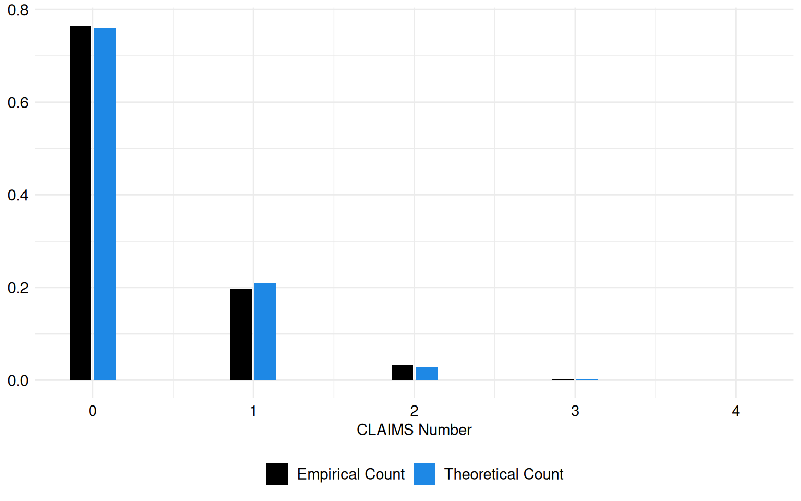
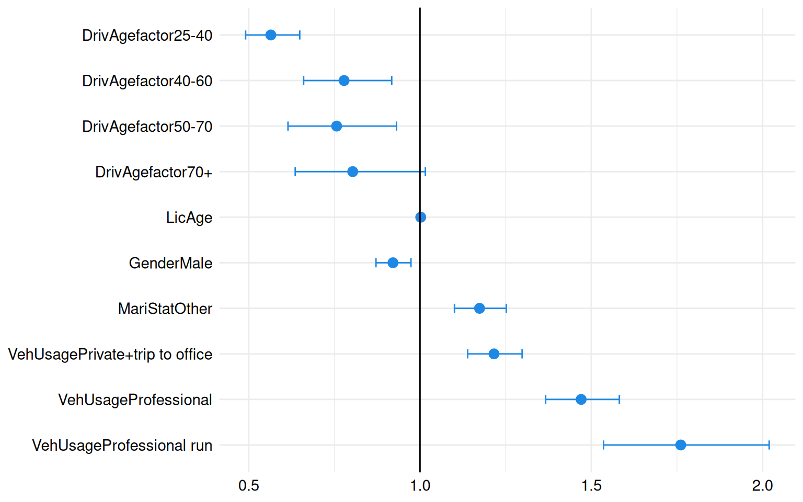
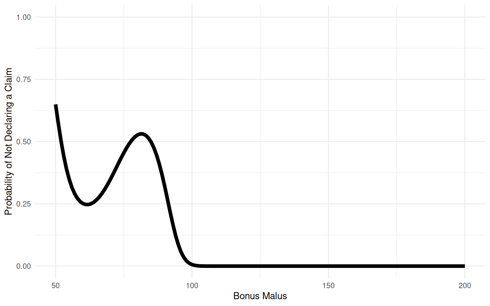
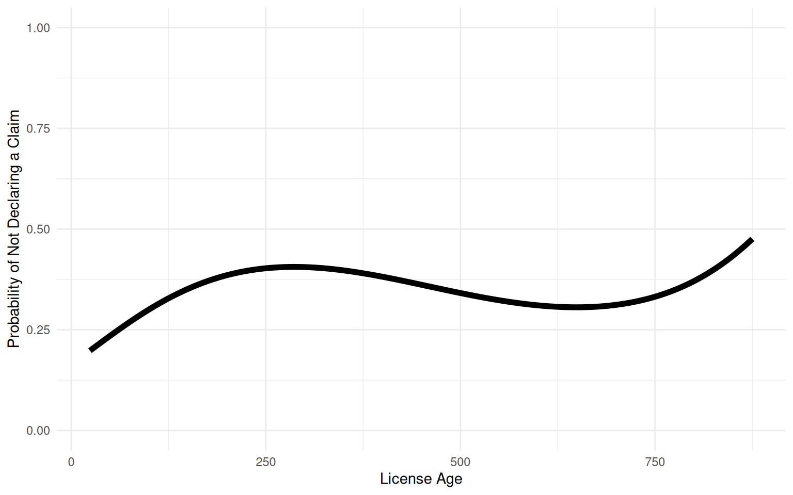
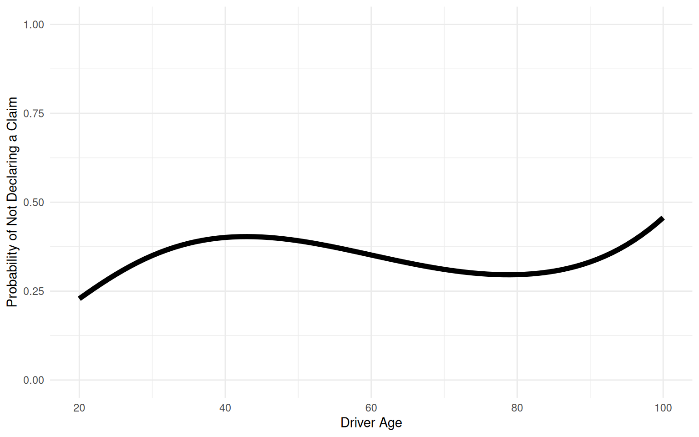

# Frequency analysis with a Zero Inflated Regression of a French Motor Third Party Liability dataset

## Introduction

Session Settings

``` r

# Graphs----
face_text='plain'
face_title='plain'
size_title = 14
size_text = 11
legend_size = 11

global_theme <- function() {
  theme_minimal() %+replace%
    theme(
      text = element_text(size = size_text, face = face_text),
      legend.position = "bottom",
      legend.direction = "horizontal", 
      legend.box = "vertical",
      legend.key = element_blank(),
      legend.text = element_text(size = legend_size),
      axis.text = element_text(size = size_text, face = face_text), 
      plot.title = element_text(
        size = size_title, 
        hjust = 0.5
      ),
      plot.subtitle = element_text(hjust = 0.5)
    )
}

# Outputs
options("digits" = 2)
```

> **In Brief**
>
> In some instances, zeros appear frequently in the data, indicating a
> specific structure that a simple Poisson model fails to account for,
> leading to biased and inaccurate estimates. To address this issue, we
> employ zero-inflated regression models, which are designed to handle
> datasets with an excess of zero counts by modeling both the occurrence
> of zeros and the count data separately.
>
> The purpose of this vignette is to illustrate the application of
> zero-inflated regression in the analysis of insurance data,
> specifically using the `freMTPL6` dataset from Charpentier
> ([2014](#ref-charpentierCAS)). This dataset comprises detailed
> information on insurance contracts and claims related to French motor
> third-party liability insurance. By applying zero-inflated regression,
> we aim to accurately model the frequency of claims and investigate the
> factors that influence claim occurrences within this insurance data,
> providing a more nuanced understanding than standard count models.

### Required Packages

Show the code

``` r

required_libraries <- c(
  "tidyverse",
  "CASdatasets",
  "pscl",
  "splines",
  "AER",
  "broom",
  "knitr",
  "kableExtra"
)
invisible(lapply(required_libraries, library, character.only = TRUE))
```

### Data

The data used in this vignette are sourced from a French motor
third-party liability insurance portfolio.

The dataset, `freMPL6`, contains comprehensive details on insurance
contracts and client information, obtained from a French insurance
company. This dataset specifically pertains to a motor insurance
portfolio, providing valuable insights into the characteristics and
behavior of policyholders within this segment of the insurance market.

### Dictionaries

The list of the 20 variables from the `freMPL6` dataset is reported in
[Table 1](#tbl-dict-frempl).

| Attribute | Type | Description |
|----|----|----|
| Exposure | Numeric | The exposure, in years |
| LicAge | Numeric | The driving license age, in months |
| RecordBeg | Date | Beginning date of record |
| RecordEnd | Date | End date of record |
| Gender | Factor | Gender of the driver, either “Male” or “Female” |
| MariStat | Factor | Marital status of the driver, either “Alone” or “Other” |
| SocioCateg | Factor | Socio-economic category of the driver, known as CSP in France, between “CSP1” and “CSP99” |
| VehUsage | Factor | Usage of the vehicle, among “Private”, “Private+trip to office”, “Professional”, “Professional run” |
| DrivAge | Numeric | Age of the driver, in years |
| HasKmLimit | Boolean | Indicator if there’s a mileage limit for the policy, 1 if yes, 0 otherwise |
| ClaimAmount | Numeric | Total claim amount of the guarantee |
| ClaimNbResp | Numeric | Number of responsible claims in the 4 preceding years |
| ClaimNbNonResp | Numeric | Number of non-responsible claims in the 4 preceding years |
| ClaimNbParking | Numeric | Number of parking claims in the 4 preceding years |
| ClaimNbFireTheft | Numeric | Number of fire-theft claims in the 4 preceding years |
| ClaimNbWindscreen | Numeric | Number of windscreen claims in the 4 preceding years |
| OutUseNb | Numeric | Number of out-of-use instances in the 4 preceding years |
| RiskArea | Numeric | Unknown risk area, between 1 and 13, possibly ordered |
| BonusMalus | Numeric | Bonus-malus coefficient, between 50 and 350: \<100 means bonus, \>100 means malus in France |
| ClaimInd | Boolean | Claim indicator of the guarantee (this is not the claim number) |

Table 1: Content of the `freMPL6` dataset

### Importation

code for importing our datasets

``` r

data("freMPL6")

freMPL6$DrivAgefactor <- cut(freMPL6$DrivAge,
                        breaks = c(-Inf, 25, 40, 60, 70, Inf),
                        labels = c("18-25","25-40", "40-60", "50-70", "70+"),
                        right = FALSE)
```

## Models

### Purpose

In the context of insurance, Zero-inflated regression models, such as
Zero-inflated Poisson (ZIP) and Zero-inflated Negative Binomial (ZINB),
are essential tools for gaining a more nuanced understanding of data
compared to simple Poisson regression. These models are particularly
advantageous when dealing with datasets that exhibit an excess of zeros,
as they differentiate between zeros that result from structural causes
(e.g., policyholders who never file claims) and those that occur by
random chance.

Zero-inflated models are especially useful when analyzing variables that
influence the likelihood of filing a claim, such as a driver’s age,
gender, or driving history. These factors often have varying
propensities to result in zero claims, which may stem from inherent
characteristics of specific driver profiles or particular usage
patterns. By explicitly modeling both the zero-generating process and
the claim-generating process, zero-inflated regression models provide
more accurate estimates and predictions. This allows insurers to enhance
risk assessments, refine pricing strategies, and make more informed
decisions.

In fields like insurance claims analysis, healthcare data analytics, and
ecological studies—where understanding the relationship between multiple
variables and the occurrence of events (such as claims or incidents) is
crucial—these models excel at capturing the complexities of the data.
They enable a more precise analysis of how different factors influence
the likelihood of events, leading to better-targeted products and
pricing strategies. Ultimately, this improves the ability to manage risk
and optimize profitability.

In this analysis, we will investigate the relationship between the
response variable `ClaimNbResp` (which represents the number of claims
where the driver is deemed responsible) and various explanatory
variables, including `DrivAge` (driver’s age), `Gender`, `LicAge` (age
of the driving license), `BonusMalus` (driver’s bonus-malus score), and
`VehUsage` (vehicle usage type). This modeling approach is consistent
with the principles advocated by Agresti ([2013](#ref-agresti)), a
renowned authority in statistical methodology, who underscores the
significance of incorporating multiple explanatory factors in regression
analysis. By including these variables in our model, we aim to gain a
deeper understanding of how these factors influence the likelihood of a
driver being responsible for a claim.

### Modeling Insurance Claim Frequency with Zero-Inflated Negative Binomial Regression

To model the frequency of insurance claims, we utilize a Zero-Inflated
Negative Binomial (ZINB) Regression approach for the response variable
`ClaimNbResp`, which represents the count of insurance claims and is
typically assumed to follow a Poisson distribution:

``` math
\text{ClaimNbResp} \sim \text{Poisson}(\mu),
```

where $`\mu`$ represents the mean rate of claims. The ZINB approach is
particularly well-suited for handling overdispersed data with excess
zeros, offering a flexible, nonlinear modeling framework. Specifically,
we express the natural logarithm of $`\mu`$ as a linear combination of
predictor variables, along with an adjustment for exposure:

``` math
\log(\mu) = \beta_0 + \beta_1 \times \text{DrivAge} + \beta_2 \times \text{Gender} + \beta_3 \times \text{LicAge} +
```
``` math
\beta_4 \times \text{BonusMalus} + \beta_5 \times \text{VehUsage} + \log(\text{Exposure}),
```

where `DrivAge` denotes the driver’s age, `Gender` is a binary variable
indicating the driver’s gender, `LicAge` represents the age of the
driving license, `BonusMalus` captures the driver’s bonus-malus score,
`VehUsage` reflects the type of vehicle usage, and
$`\log(\text{Exposure})`$ adjusts for the exposure variable. The
coefficients $`\beta_0, \beta_1, \beta_2, \beta_3, \beta_4, \beta_5`$
are parameters to be estimated through the regression process.

In addition to the count component, the zero-inflation part of the model
accounts for the probability of excess zeros via a logistic regression
model:

``` math
\text{Logit}(P(\text{zero})) = Z\gamma,
```

where $`Z`$ represents the matrix of covariates for the zero-inflation
model, and $`\gamma`$ is the vector of coefficients associated with
these covariates.

In this framework, the intercept $`\beta_0`$ and the coefficients
$`\beta_1, \beta_2, \beta_3, \beta_4, \beta_5`$ are estimated to
quantify their effects on the expected rate of claims. The logistic
regression component for zero inflation enhances the model’s capacity to
capture complex, nonlinear relationships and the presence of excess
zeros in the data, resulting in a more flexible and accurate model fit.

> **Pay Attention**
>
> The results from Zero-inflated regression models are valid under the
> following conditions:
>
> - The responses are independent.
> - The responses follow a Poisson distribution with parameter
>   $`\lambda`$.
> - There may be
>   [overdispersion](https://en.wikipedia.org/wiki/Overdispersion)
>   present in the data.

The estimated $`\mu`$ parameter, which represents the mean of claims, is
0.28.

``` r

set.seed(1234) 

theoretic_count <- rpois(nrow(freMPL6), mean(freMPL6$ClaimNbResp))

tc_df <- tibble(theoretic_count)

freq_theoretic <- prop.table(table(tc_df$theoretic_count))

freq_claim <- prop.table(table(freMPL6$ClaimNbResp))

freq_theoretic_df <- tibble(
  Count = as.numeric(names(freq_theoretic)),
  Frequency = as.numeric(freq_theoretic),
  Source = "Theoretical Count"
)

freq_claim_df <- tibble(
  Count = as.numeric(names(freq_claim)),
  Frequency = as.numeric(freq_claim),
  Source = "Empirical Count"
)

freq_combined <- freq_theoretic_df |> 
  rbind(freq_claim_df)
```

The theoretical and empirical histograms associated with a Poisson
distribution are shown in [Figure 1](#fig-plot-hist-claims).

Code for the following graph

``` r

ggplot(freq_combined, aes(x = Count, y = Frequency, fill = Source)) +
  geom_bar(stat = "identity", position = "dodge2", width = 0.3) +
  labs(x = "CLAIMS Number", y = "Frequency", fill = "Legend") +
  theme(legend.position = "right") +
  scale_fill_manual(
    NULL,
    values = c("Empirical Count" = "black", "Theoretical Count" = "#1E88E5")
  ) +
  labs(fill = "Legend") +
  labs(x = "CLAIMS Number", y = NULL) +
  theme(legend.position = "right")+
  global_theme()
```



Figure 1: Theoretical and empirical histogram of claims in frequence

``` r

freg <- formula(ClaimNbResp ~ DrivAgefactor + LicAge
                + Gender + BonusMalus +  MariStat
                + VehUsage + offset(Exposure)|
                  Gender + DrivAgefactor + BonusMalus + LicAge)

reg <- zeroinfl(freg, data = freMPL6, dist = "poisson")

summary(reg)
```


    Call:
    zeroinfl(formula = freg, data = freMPL6, dist = "poisson")

    Pearson residuals:
       Min     1Q Median     3Q    Max
    -3.540 -0.467 -0.385 -0.205 49.895

    Count model coefficients (poisson with log link):
                                    Estimate Std. Error z value Pr(>|z|)
    (Intercept)                    -3.959372   0.101641  -38.95  < 2e-16 ***
    DrivAgefactor25-40             -0.571843   0.071161   -8.04  9.3e-16 ***
    DrivAgefactor40-60             -0.250608   0.083906   -2.99   0.0028 **
    DrivAgefactor50-70             -0.278896   0.105990   -2.63   0.0085 **
    DrivAgefactor70+               -0.218682   0.119502   -1.83   0.0673 .
    LicAge                          0.002107   0.000168   12.56  < 2e-16 ***
    GenderMale                     -0.082151   0.028257   -2.91   0.0036 **
    BonusMalus                      0.028854   0.000582   49.56  < 2e-16 ***
    MariStatOther                   0.160262   0.032868    4.88  1.1e-06 ***
    VehUsagePrivate+trip to office  0.195580   0.033319    5.87  4.4e-09 ***
    VehUsageProfessional            0.385543   0.037311   10.33  < 2e-16 ***
    VehUsageProfessional run        0.565935   0.069797    8.11  5.1e-16 ***

    Zero-inflation model coefficients (binomial with logit link):
                        Estimate Std. Error z value Pr(>|z|)
    (Intercept)         3.37e+01   2.22e+00   15.18   <2e-16 ***
    GenderMale          8.93e-02   1.04e-01    0.86   0.3913
    DrivAgefactor25-40 -1.48e+01   1.02e+00  -14.45   <2e-16 ***
    DrivAgefactor40-60 -1.61e+01   1.03e+00  -15.66   <2e-16 ***
    DrivAgefactor50-70 -1.63e+01   1.06e+00  -15.45   <2e-16 ***
    DrivAgefactor70+   -1.65e+01   1.08e+00  -15.31   <2e-16 ***
    BonusMalus         -3.76e-01   2.46e-02  -15.27   <2e-16 ***
    LicAge              1.97e-03   6.88e-04    2.86   0.0043 **
    ---
    Signif. codes:  0 '***' 0.001 '**' 0.01 '*' 0.05 '.' 0.1 ' ' 1

    Number of iterations in BFGS optimization: 42
    Log-likelihood: -1.93e+04 on 20 Df

This Zero-Inflated regression model is used to predict `NbClaim` (number
of claims) with `DrivAge`,`LicAge` , `Gender`, `MariStat` (marital
status), `BonusMalus`, and `VehUsage` as predictor variables.

#### Count Model (Poisson with Log Link):

In the count component of the model, the coefficients represent the
estimated change in the log count of responsible claims (`ClaimNbResp`)
associated with each predictor level, relative to a reference level. For
instance, the coefficients for drivers aged 25-40, 40-60, 50-70, and 70+
are all negative compared to the reference group (drivers younger than
25), indicating that older drivers are associated with a lower log count
of responsible claims. The statistical significance of these
coefficients (p \< 0.05) underscores their importance in predicting the
frequency of responsible claims, suggesting that age is a key factor in
claim occurrence.

#### Zero-Inflation Model (Binomial with Logit Link):

The coefficients in the zero-inflation component model the log-odds of
observing excess zeros (zero-inflation) versus non-excess zeros. The
results indicate that older age groups (25-40, 40-60, 50-70, 70+)
significantly reduce the log-odds of zero-inflation compared to the
reference group (drivers younger than 25). This implies that younger
drivers are more likely to contribute to the excess zeros in the data,
potentially due to not filing claims despite having a higher risk
profile.

The variables `LicAge` and `BonusMalus` also influence zero-inflation,
with `LicAge` slightly increasing the log-odds of zero-inflation,
suggesting that more experienced drivers might be more likely to
contribute to the excess zeros. Conversely, `BonusMalus` significantly
decreases the log-odds, indicating that drivers with higher bonus-malus
scores are less likely to contribute to the excess zeros. Interestingly,
the `Gender` variable (Male) is not statistically significant in the
zero-inflation model, suggesting that gender may not be a strong
predictor of whether a claim is filed or not.

This analysis provides valuable insights into the factors that influence
both the frequency of responsible claims and the likelihood of
zero-inflation in the dataset, allowing for more nuanced risk
assessments and pricing strategies.

- [Count](#tabset-3-1)
- [Zero](#tabset-3-2)

&nbsp;

- - [Coefficients](#tabset-1-1)
  - [Count-Ratio and Confidence intervals](#tabset-1-2)

  Code to create the table
  ``` r

  summary_reg <- summary(reg)

  # Create a tidy data frame for the count model coefficients
  tidy_count <- summary_reg$coefficients$count |>
    as.data.frame() |>
    mutate(significance = case_when(
      `Pr(>|z|)` < 0.001 ~ "***",
      `Pr(>|z|)` < 0.01 ~ "**",
      `Pr(>|z|)` < 0.05 ~ "*",
      `Pr(>|z|)` < 0.1 ~ ".",
      TRUE ~ ""
    ))

  kable(tidy_count, format = "html", escape = FALSE) |>
    kable_styling(full_width = FALSE) |>
    add_footnote(c("Significance levels : *** p < 0.001, ** p < 0.01, * p < 0.05, . p < 0.1"),
                 notation = "none")
  ```

  |  | Estimate | Std. Error | z value | Pr(\>\|z\|) | significance |
  |:---|---:|---:|---:|---:|:---|
  | (Intercept) | -3.96 | 0.10 | -39.0 | 0.00 | \*\*\* |
  | DrivAgefactor25-40 | -0.57 | 0.07 | -8.0 | 0.00 | \*\*\* |
  | DrivAgefactor40-60 | -0.25 | 0.08 | -3.0 | 0.00 | \*\* |
  | DrivAgefactor50-70 | -0.28 | 0.11 | -2.6 | 0.01 | \*\* |
  | DrivAgefactor70+ | -0.22 | 0.12 | -1.8 | 0.07 | . |
  | LicAge | 0.00 | 0.00 | 12.6 | 0.00 | \*\*\* |
  | GenderMale | -0.08 | 0.03 | -2.9 | 0.00 | \*\* |
  | BonusMalus | 0.03 | 0.00 | 49.6 | 0.00 | \*\*\* |
  | MariStatOther | 0.16 | 0.03 | 4.9 | 0.00 | \*\*\* |
  | VehUsagePrivate+trip to office | 0.20 | 0.03 | 5.9 | 0.00 | \*\*\* |
  | VehUsageProfessional | 0.39 | 0.04 | 10.3 | 0.00 | \*\*\* |
  | VehUsageProfessional run | 0.57 | 0.07 | 8.1 | 0.00 | \*\*\* |
  |  Significance levels : \*\*\* p \< 0.001, \*\* p \< 0.01, \* p \< 0.05, . p \< 0.1 |  |  |  |  |  |

  Table 2: Coefficients for the Count model

  Code to create the table
  ``` r

  estimates <- summary_reg$coefficients$count[-1, ] 

  exp_estimates <- exp(estimates[, "Estimate"])

  p_values <- estimates[, "Pr(>|z|)"]

  conf_int <- confint(reg)

  conf_int_exp <- exp(conf_int)

  reg_count_ratio <- data.frame(
    count_ratio = round(exp_estimates, 2),
    `CI 2.5` = conf_int_exp[2:12, 1],
    `CI 97.5` = conf_int_exp[2:12, 2],
    p.value = p_values
  )

  reg_count_ratio <- reg_count_ratio |>
    mutate(significance = case_when(
      p.value < 0.001 ~ "***",
      p.value < 0.01 ~ "**",
      p.value < 0.05 ~ "*",
      p.value < 0.1 ~ ".",
      TRUE ~ ""
    )) |>
    dplyr::select(-p.value)

  kable(reg_count_ratio, format = "html", escape = FALSE, digits = 2) |>
    kable_styling(full_width = FALSE) |>
    add_footnote(c("Significance levels: *** p < 0.001, ** p < 0.01, * p < 0.05, . p < 0.1"),
                 notation = "none")
  ```

  |  | count_ratio | CI.2.5 | CI.97.5 | significance |
  |:---|---:|---:|---:|:---|
  | DrivAgefactor25-40 | 0.56 | 0.49 | 0.65 | \*\*\* |
  | DrivAgefactor40-60 | 0.78 | 0.66 | 0.92 | \*\* |
  | DrivAgefactor50-70 | 0.76 | 0.61 | 0.93 | \*\* |
  | DrivAgefactor70+ | 0.80 | 0.64 | 1.02 | . |
  | LicAge | 1.00 | 1.00 | 1.00 | \*\*\* |
  | GenderMale | 0.92 | 0.87 | 0.97 | \*\* |
  | BonusMalus | 1.03 | 1.03 | 1.03 | \*\*\* |
  | MariStatOther | 1.17 | 1.10 | 1.25 | \*\*\* |
  | VehUsagePrivate+trip to office | 1.22 | 1.14 | 1.30 | \*\*\* |
  | VehUsageProfessional | 1.47 | 1.37 | 1.58 | \*\*\* |
  | VehUsageProfessional run | 1.76 | 1.54 | 2.02 | \*\*\* |
  |  Significance levels: \*\*\* p \< 0.001, \*\* p \< 0.01, \* p \< 0.05, . p \< 0.1 |  |  |  |  |

  Table 3: Count Ratio and confidence intervals for the Count model

  Each count ratio reflects the change in the odds of making a
  responsible claim (`ClaimNbResp`) associated with a one-unit increase
  in the predictor variable, relative to the reference category. For
  example, a count ratio of 0.56 for drivers aged 25-40 indicates that
  the odds of making a responsible claim for this age group are
  approximately -44% lower compared to the reference category, which
  consists of drivers younger than 25. Similarly, for drivers aged
  40-60, the odds decrease by -22% relative to the reference category.

  However, as drivers age beyond 60, the data suggests that the
  likelihood of making a responsible claim increases. This pattern
  indicates that while middle-aged drivers (25-60) have lower odds of
  making a responsible claim compared to younger drivers, the odds begin
  to rise in older age groups, suggesting an increased risk of
  responsible claims as age advances.

- [Coefficents](#tabset-2-1)
- [Count-Ratio and Confidence intervals](#tabset-2-2)

code to create the table

``` r

# Create a tidy data frame for the zero-inflation model coefficients
tidy_zero <- summary_reg$coefficients$zero |>
  as.data.frame() |>
  mutate(significance = case_when(
    `Pr(>|z|)` < 0.001 ~ "***",
    `Pr(>|z|)` < 0.01 ~ "**",
    `Pr(>|z|)` < 0.05 ~ "*",
    `Pr(>|z|)` < 0.1 ~ ".",
    TRUE ~ ""
  ))

kable(tidy_zero, format = "html", escape = FALSE) |>
  kable_styling(full_width = FALSE) |>
  add_footnote(c("Significance levels : *** p < 0.001, ** p < 0.01, * p < 0.05, . < 0.05"),
               notation = "none")
```

|  | Estimate | Std. Error | z value | Pr(\>\|z\|) | significance |
|:---|---:|---:|---:|---:|:---|
| (Intercept) | 33.65 | 2.22 | 15.18 | 0.00 | \*\*\* |
| GenderMale | 0.09 | 0.10 | 0.86 | 0.39 |  |
| DrivAgefactor25-40 | -14.79 | 1.02 | -14.45 | 0.00 | \*\*\* |
| DrivAgefactor40-60 | -16.10 | 1.03 | -15.66 | 0.00 | \*\*\* |
| DrivAgefactor50-70 | -16.34 | 1.06 | -15.45 | 0.00 | \*\*\* |
| DrivAgefactor70+ | -16.49 | 1.08 | -15.31 | 0.00 | \*\*\* |
| BonusMalus | -0.38 | 0.02 | -15.27 | 0.00 | \*\*\* |
| LicAge | 0.00 | 0.00 | 2.86 | 0.00 | \*\* |
|  Significance levels : \*\*\* p \< 0.001, \*\* p \< 0.01, \* p \< 0.05, . \< 0.05 |  |  |  |  |  |

Table 4: Coefficients for the Zero model

Code to create the table

``` r

estimates <- summary_reg$coefficients$zero[-1, ]

exp_estimates <- exp(estimates[, "Estimate"])

p_values <- estimates[, "Pr(>|z|)"]

conf_int <- confint(reg)

conf_int_exp <- exp(conf_int)

reg_count_ratio <- data.frame(
  count_ratio = exp_estimates,
  `CI 2.5` = conf_int_exp[13:19, 1],
  `CI 97.5` = conf_int_exp[13:19, 2],
  p.value = p_values
)

reg_count_ratio <- reg_count_ratio |>
  mutate(significance = case_when(
    p.value < 0.001 ~ "***",
    p.value < 0.01 ~ "**",
    p.value < 0.05 ~ "*",
    p.value < 0.1 ~ ".",
    TRUE ~ ""
  )) |>
  dplyr::select(-p.value)

kable(reg_count_ratio, format = "html", escape = FALSE) |>
  kable_styling(full_width = FALSE) |>
  add_footnote(c("Significance levels: *** p < 0.001, ** p < 0.01, * p < 0.05, . p < 0.1"),
               notation = "none")
```

|  | count_ratio | CI.2.5 | CI.97.5 | significance |
|:---|---:|---:|---:|:---|
| GenderMale | 1.09 | 5.4e+12 | 3.2e+16 |  |
| DrivAgefactor25-40 | 0.00 | 8.9e-01 | 1.3e+00 | \*\*\* |
| DrivAgefactor40-60 | 0.00 | 0.0e+00 | 0.0e+00 | \*\*\* |
| DrivAgefactor50-70 | 0.00 | 0.0e+00 | 0.0e+00 | \*\*\* |
| DrivAgefactor70+ | 0.00 | 0.0e+00 | 0.0e+00 | \*\*\* |
| BonusMalus | 0.69 | 0.0e+00 | 0.0e+00 | \*\*\* |
| LicAge | 1.00 | 6.5e-01 | 7.2e-01 | \*\* |
|  Significance levels: \*\*\* p \< 0.001, \*\* p \< 0.01, \* p \< 0.05, . p \< 0.1 |  |  |  |  |

Table 5: Count-Ratio and Confidence intervals for the Zero model

## Graphs

- [Count Model](#tabset-5-1)
- [Zero Model](#tabset-5-2)

&nbsp;

- Code to create the following graph
  ``` r

  estimates <- summary_reg$coefficients$count[-1, ] 

  count_ratio <- exp(estimates[, "Estimate"])

  conf_int <- exp(confint(reg))[-1, ]

  vars_count <- grep("^(DrivAge|Gender|LicAge|MariStat|VehUsage)", names(count_ratio), value = TRUE)

  vars_count_with_count <- paste0("count_", vars_count)

  data_age <- tibble(
    variable = vars_count,
    coefficient = count_ratio[vars_count], 
    lower_bound = conf_int[vars_count_with_count, 1], 
    upper_bound = conf_int[vars_count_with_count, 2]
  )

  data_age$variable <- factor(data_age$variable, levels = rev(vars_count))


  ggplot(
    data_age, 
    aes(
      x = coefficient,
      y = variable,
      xmin = lower_bound,
      xmax = upper_bound
    )
  ) +
    geom_point(stat = "identity", size = 3, color = "#1E88E5") +
    geom_errorbar(
      width = 0.2,
      position = position_dodge(width = 0.6),
      color = "#1E88E5"
    ) +
    geom_vline(xintercept = 1, color = "black", linetype = "solid") +
    labs(
      x = NULL,
      y = NULL
    ) +
    global_theme()
  ```

  

  Figure 2: Counts ratio and confidence intervals of the count model

We will utilize splines to visualize the impact of `BonusMalus`,
`LicAge`, and `DrivAge` on the non-claiming rate. Splines, which are
piecewise polynomial functions, provide a powerful tool for smoothing
and capturing non-linear relationships that linear models may fail to
detect.

In the context of claim regression, splines are particularly effective
for modeling the complex, non-linear effects of factors such as age,
income, or policy duration on the likelihood or frequency of claims. By
allowing the model to adapt flexibly to the data’s underlying structure,
this approach enhances both the accuracy and fit of the model.
Consequently, insurers can achieve more precise risk assessments and
make more informed decisions regarding pricing and policy underwriting.

- [Bonus Malus impact](#tabset-4-1)
- [License Age Impact](#tabset-4-2)
- [Age Impact](#tabset-4-3)

Code to create the following graph

``` r

regZIbm <- zeroinfl(ClaimNbResp ~ 1 | bs(BonusMalus), 
                    offset = log(Exposure), 
                    data = freMPL6, 
                    dist = "poisson", 
                    link = "logit")
```

    Warning: glm.fit: fitted probabilities numerically 0 or 1 occurred

Code to create the following graph

``` r

C <- tibble(BonusMalus = 50:200, Exposure = 1)

pred0 <- regZIbm |> 
  predict(newdata = C, type = "zero")
```

    Warning in bs(BonusMalus, degree = 3L, knots = numeric(0), Boundary.knots =
    c(50L, : some 'x' values beyond boundary knots may cause ill-conditioned bases

Code to create the following graph

``` r

C |> 
  mutate(Prediction = pred0) |> 
  ggplot(aes(x = BonusMalus, y = Prediction)) +
  geom_line(size = 2) +
  labs(x = "Bonus Malus", y = "Probability of Not Declaring a Claim") +
  ylim(0, 1) +
  theme_minimal()
```

    Warning: Using `size` aesthetic for lines was deprecated in ggplot2 3.4.0.
    ℹ Please use `linewidth` instead.



Figure 3: Bonus Malus impact on Claim Non-Declaration

The plot reveals that when the Bonus-Malus score is below 100,
indicating a bonus, there is a higher probability of not declaring a
claim. As the Bonus-Malus score increases beyond 100, this probability
declines sharply, suggesting that drivers with higher scores are more
inclined to report a claim.

This trend may imply that drivers who have accumulated bonuses are more
likely to avoid declaring claims in an effort to preserve their
favorable score, thus minimizing the potential increase in their
insurance premiums.

Code to create the following graph

``` r

regZIbm <- zeroinfl(ClaimNbResp ~ 1 | bs(LicAge), 
                    offset = log(Exposure), 
                    data = freMPL6, 
                    dist = "poisson", 
                    link = "logit")

A <- tibble(LicAge = min(freMPL6$LicAge):max(freMPL6$LicAge), Exposure = 1)

pred0 <- regZIbm |> 
  predict(newdata = A, type = "zero")

A |> 
  mutate(Prediction = pred0) |>
  ggplot(aes(x = LicAge, y = Prediction)) +
  geom_line(size = 2) +
  labs(x = "License Age", y = "Probability of Not Declaring a Claim") +
  ylim(0, 1) +
  theme_minimal()
```



Figure 4: License Age impact on Claim Non-Declaration

Code to create the following graph

``` r

regZIbm <- zeroinfl(ClaimNbResp ~ 1 | bs(DrivAge), 
                    offset = log(Exposure), 
                    data = freMPL6, 
                    dist = "poisson", 
                    link = "logit")

B <- tibble(DrivAge = 20:100, Exposure = 1)

pred0 <- predict(regZIbm, newdata = B, type = "zero")
```

    Warning in bs(DrivAge, degree = 3L, knots = numeric(0), Boundary.knots = c(20L,
    : some 'x' values beyond boundary knots may cause ill-conditioned bases

Code to create the following graph

``` r

B |>
  mutate(Prediction = pred0) |>
  ggplot(aes(x = DrivAge, y = Prediction)) +
  geom_line(size = 2) +
  labs(x = "Driver Age", y = "Probability of Not Declaring a Claim") +
  ylim(0, 1) +
  theme_minimal()
```



Figure 5: Age impact on Claim Non-Declaration

## References

Agresti, Alan. 2013. *Categorical Data Analysis, 3rd Edition*.

Charpentier, Arthur. 2014. *Computational Actuarial Science with R*. The
R Series. Chapman; Hall/CRC.
<https://www.routledge.com/Computational-Actuarial-Science-with-R/Charpentier/p/book/9781138033788>.

## See also

For more similar claim frequency datasets with a Poisson-like
distribution, see
[`freMTPL`](https://dutangc.github.io/CASdatasets/reference/freMTPL.html)
(import with `data("freMTPLfreq")`): French automobile dataset,
[`beMTPL16`](https://dutangc.github.io/CASdatasets/reference/beMTPL16.html):
Belgian automobile dataset (import with `data("beMTPL16")`),
[`ausprivauto0405`](https://dutangc.github.io/CASdatasets/reference/ausprivauto.html)
(import with `data("ausprivauto0405")`): Australian automobile dataset,
or
[`pg17trainpol`](https://dutangc.github.io/CASdatasets/reference/pricingame.html)
(import with `data("pg17trainpol")`).
